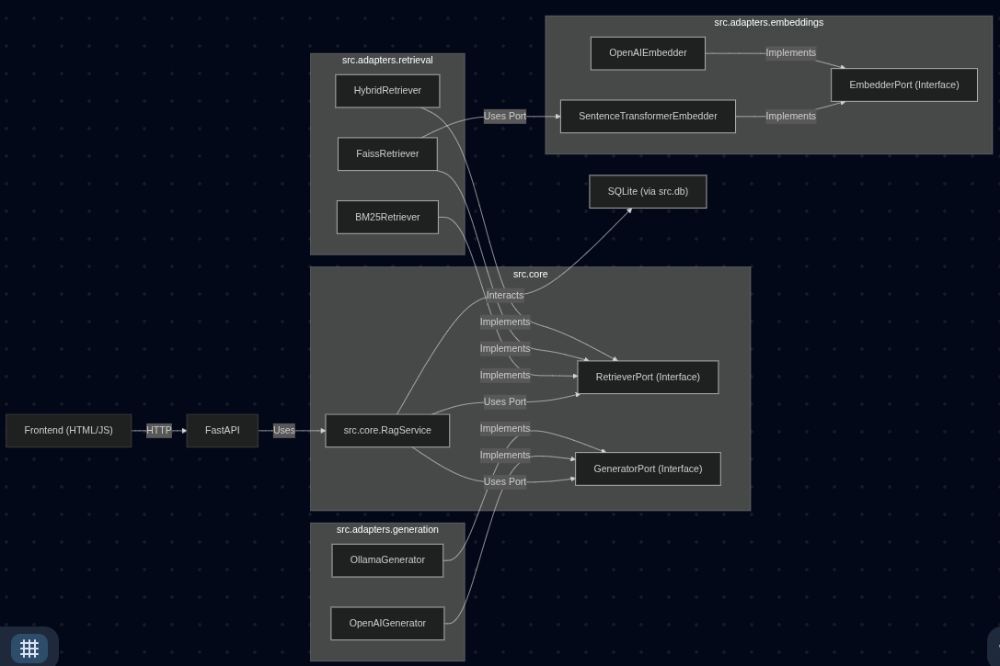

# 🧠 Local-RAG Backend & Frontend

> **Goal**: A minimalist Q&A prototype with Retrieval-Augmented Generation (RAG), showcasing design thinking and implementation capabilities under time constraints. This project includes a full-stack web application with a simple user interface.

---

## 0. Table of Contents

1.  [Project Structure](#1-project-structure)
2.  [Why This Design?](#2-why-this-design)
3.  [Architecture at a Glance](#3-architecture-at-a-glance)
4.  [Quick Start](#4-quick-start)
5.  [Configuration](#5-configuration)
6.  [Running the Application](#6-running-the-application)
7.  [Running Tests](#7-running-tests)
8.  [API Endpoints](#8-api-endpoints)
9.  [Design Decisions & Trade-Offs](#9-design-decisions--trade-offs)
10. [Known Limitations](#10-known-limitations)
11. [Further Reading / Bonus](#11-further-reading--bonus)

---

## 1. Project Structure

A brief overview of the main directories:

*   `data/`: Contains the input CSV (`faq.csv`) and serves as the default location for the SQLite database and FAISS index.
*   `frontend/`: Contains the `index.html` file for the minimal user interface.
*   `scripts/`: Includes utility scripts, notably `build_index.py` for pre-populating the database and building vector indexes.
*   `src/`: The core application code.
    *   `adapters/`: Concrete implementations (drivers) for external services or specific algorithms (e.g., BM25, FAISS, OpenAI, Ollama).
    *   `app/`: FastAPI application setup, API routing, and dependency injection.
    *   `core/`: Domain logic, use cases (e.g., `RagService`), and abstract ports (interfaces). Pure Python.
    *   `db/`: SQLAlchemy models, CRUD operations, and database session management.
*   `tests/`: Automated tests.
    *   `unit/`: Unit tests for individual components, with subdirectories fatores/adapters`.
    *   `integration/`: Integration tests palavras-chave API endpoints.
*   `notebooks/`: (Optional) Jupyter notebooks for experimentation or demos.
*   `bonus/`: (Optional) Skeleton code for more advanced integrations.

---

## 2. Why This Design?

| Need (from task)        | My Reasoning                                     | Implementation Choice                                     |
| :---------------------- | :----------------------------------------------- | :-------------------------------------------------------- |
| *Rapid Prototyping*     | Zero external infra; minimal pure-Python deps.   | SQLite + BM25 (default), FastAPI + Vanilla JS Frontend. |
| *Scalable Path*         | Ability to swap components without major refactor. | Ports & Adapters (Hexagonal Architecture).              |
| *AI Integration*        | Must work offline **or** with OpenAI.            | `GeneratorPort` → `OpenAIGenerator` / `OllamaGenerator`.  |
| *Data Handling*         | Basic knowledge base from CSV.                   | CSV ingested into SQLite; FAISS option for dense search.  |
| *Efficient Reviewer UX* | Clone → install → (build index) → test → run.  | `build_index.py` script, `.env` based `settings.py`.    |
| *Minimal UI*            | Simple, functional, no heavy frameworks.         | Single `index.html` with vanilla HTML/CSS/JS.             |

---

## 3. Architecture at a Glance

The application follows a Ports & Adapters (Hexagonal) architecture to promote separation of concerns and testability.



**Dependency Rule:** Arrows of `import` statements primarily point inwards, towards the `src/core` components. This adheres to the Dependency Inversion Principle.

---

## 4. Quick Start

1.  **Create Environment & Install Dependencies:**
    ```bash
    python -m venv .venv
    source .venv/bin/activate  # On Windows: .venv\Scripts\activate
    pip install .
    ```

2.  **(Optional) Create `.env` file:**
    Copy `.env.example` to `.env` (if provided) or create a new `.env` file in the project root. Configure your `OPENAI_API_KEY` if you plan to use OpenAI, or set `OLLAMA_ENABLED=true` if you have a local Ollama instance running with the required models.
    ```env
    # Example .env content
    # OPENAI_API_KEY="sk-yourkeyhere"
    # OLLAMA_ENABLED=true
    # OLLAMA_MODEL="deepseek-r1:1.5B"
    ```

3.  **Initialize Database & Build Index (Recommended First Step):**
    This script populates the SQLite database from `data/faq.csv` and builds vector indexes if dense retrieval is configured.
    ```bash
    python -m scripts.build_index
    ```
    *Note: The application will attempt to create DB tables on startup if they don't exist and populate from `data/faq.csv` if the `documents` table is empty (for sparse mode). However, running `build_index.py` is recommended, especially for dense mode.*

4.  **Run the Application:**
    ```bash
    uvicorn src.app.main:app --reload --host 0.0.0.0 --port 8000
    ```
    *   Wait some seconds, till the CLI logs output: "Application startup complete."
    *   Access the web UI at: `http://localhost:8000/`
    *   API (Swagger) docs at: `http://localhost:8000/docs`

**Docker (Alternative):**

1.  Build the Docker image:
    ```bash
    docker build -t local-rag-app .
    ```
2.  Run the Docker container:
    ```bash
    # 1) build & run sólo backend (OpenAI):
    docker build -t local-rag .
    docker run -p 8000:8000 -e OPENAI_API_KEY=<key> local-rag

    # 2) stack con Ollama:
    docker compose --profile with-ollama up --build
    # (primer arranque descarga el modelo indicado en settings.ollama_model)

    ```
    La UI estará disponible en http://localhost:8000/.


---

## 5. Configuration

The application is configured via environment variables (loaded from an `.env` file if present) managed by `src/settings.py`.

| Env Var                     | Default                        | Description                                                                 |
| :-------------------------- | :----------------------------- | :-------------------------------------------------------------------------- |
| `SQLITE_URL`                | `sqlite:///./data/app.db`      | Database connection string.                                                 |
| `FAQ_CSV`                   | `data/faq.csv`                 | Path to the FAQ CSV file for `build_index.py` and initial data load.      |
| `RETRIEVAL_MODE`            | `sparse`                       | Retrieval strategy: `sparse` (BM25) or `dense` (FAISS).                     |
| `INDEX_PATH`                | `data/index.faiss`             | Path for FAISS index file (if `dense` mode).                                |
| `ID_MAP_PATH`               | `data/id_map.pkl`              | Path for FAISS ID map file (if `dense` mode).                               |
| `OPENAI_API_KEY`            | `None`                         | Your OpenAI API key. Required if not using Ollama.                          |
| `OPENAI_MODEL`              | `gpt-3.5-turbo`                | OpenAI model for chat completion.                                           |
| `OPENAI_EMBEDDING_MODEL`    | `text-embedding-3-small`       | OpenAI model for embeddings.                                                |
| `OPENAI_TEMPERATURE`        | `0.2`                          | OpenAI sampling temperature.                                                |
| `OPENAI_TOP_P`              | `1.0`                          | OpenAI nucleus sampling (top_p).                                              |
| `OPENAI_MAX_TOKENS`         | `256`                          | Max tokens for OpenAI generated answer.                                     |
| `OLLAMA_ENABLED`            | `false`                        | Set to `true` to use local Ollama server.                                   |
| `OLLAMA_MODEL`              | `mistral`                      | Default Ollama model to use (ensure it's pulled: `ollama pull mistral`).    |
| `OLLAMA_BASE_URL`           | `http://localhost:11434`       | Base URL for your Ollama instance.                                          |
| `OLLAMA_REQUEST_TIMEOUT`    | `90`                           | Timeout in seconds for requests to Ollama.                                  |

---

## 6. Running the Application

1.  **Ensure all dependencies are installed** (see Quick Start).
2.  **Set up your `.env` file** with necessary configurations (e.g., `OPENAI_API_KEY` or `OLLAMA_ENABLED=true`).
3.  **(Recommended) Run the `build_index.py` script** to populate the database and create vector indexes:
    ```bash
    python scripts/build_index.py
    ```
4.  **Start the FastAPI server:**
    ```bash
    uvicorn src.app.main:app --reload --host 0.0.0.0 --port 8000
    ```
5.  **Access the application:**
    *   **Web Interface:** Open your browser to `http://localhost:8000/`
    *   **API Documentation (Swagger UI):** `http://localhost:8000/docs`
    *   **Alternative API Documentation (ReDoc):** `http://localhost:8000/redoc`

---

## 7. Running Tests

Ensure you are in the project root directory with your virtual environment activated.

```bash
pytest
```
Or for a quieter output:
```bash
pytest -q
```
To run tests for a specific file or directory:
```bash
pytest tests/unit/
pytest tests/integration/test_api_ask.py
```

The test suite includes:
*   **Unit tests** for core logic, adapters (with mocked external services), and utility functions.
*   **Integration tests** for API endpoints, ensuring a configured in-memory SQLite database and mocked LLM calls.
The `conftest.py` file in the `tests/` directory handles the setup of the test environment, including the in-memory database and initial data loading for integration tests.

### 7.1. Test Coverage

Test coverage is measured using `pytest-cov`. To generate a report:

```bash
pytest --cov=src --cov-report=html
# Open htmlcov/index.html to view the detailed HTML report.
# Alternatively, for a quick summary in the console:
# pytest --cov=src
```

## 8. API Endpoints

The primary API endpoints are exposed under the `/api` prefix.

| Method | Path           | Request Body (JSON)   | Response Body (JSON)                                 | Description                                     |
| :----- | :------------- | :-------------------- | :--------------------------------------------------- | :---------------------------------------------- |
| `GET`  | `/`            | N/A                   | HTML                                                 | Serves the frontend user interface.             |
| `POST` | `/api/ask`     | `{"question": "str"}` | `{"answer": "str", "source_ids": ["list_of_int"]}` | Accepts a question, returns an AI-generated answer and source document IDs. |
| `GET`  | `/api/history` | Query Params: `limit`, `offset` | `[{"id": int, "question": "str", ...}]`        | Retrieves a list of past Q&A pairs.             |

Full interactive API documentation is available via Swagger UI at `/docs` and ReDoc at `/redoc` when the server is running.

---

## 9. Design Decisions & Trade-Offs

| Aspect             | Chosen Approach                                       | Alternatives Considered        | Rationale                                                                          |
| :----------------- | :---------------------------------------------------- | :--------------------------- | :--------------------------------------------------------------------------------- |
| **Backend**        | Python, FastAPI                                       | Flask, Django                | FastAPI for performance, async support, Pydantic validation, auto API docs.        |
| **Frontend**       | Vanilla HTML, CSS, JavaScript                         | React, Vue, Jinja2 templates | Simplicity for rapid prototyping; fulfills minimal UI task requirement.            |
| **Architecture**   | Ports & Adapters (Hexagonal)                          | Monolithic, Layered          | Decoupling, testability, swappable components (e.g., different LLMs, DBs).       |
| **Data Store**     | SQLite                                                | In-memory list, CSV, Postgres| Minimal persistent storage with ORM (SQLAlchemy); simple setup.                  |
| **Data Ingestion** | CSV (`data/faq.csv`) processed by `scripts/build_index.py` | Direct DB input, API upload  | Simple for FAQ-like data; script allows pre-processing and index building.       |
| **Retrieval**      | BM25 (default, sparse), FAISS (optional, dense)       | TF-IDF, other vector DBs     | BM25 for zero-dependency quick start. FAISS to demonstrate embedding-based lookup. |
| **LLM Interface**  | `GeneratorPort` with `OpenAIGenerator`, `OllamaGenerator` | Direct SDK calls in service  | Abstraction allows easy switching between local (Ollama) and cloud (OpenAI) LLMs. |
| **Testing**        | Pytest, `TestClient`, `unittest.mock`                 | `unittest`                   | Pytest for cleaner syntax, powerful fixtures. `TestClient` for API integration.    |

---

## 10. Known Limitations
*   Dense retrieval only **ASSUMING  build_index.py have been already EXECUTED!!**
*   **Frontend Simplicity:** The UI is intentionally minimal. A production application would require a more robust frontend framework, state management, and enhanced UX.
*   **Error Handling:** While basic error handling is in place for API calls and LLM interactions, a production system would need more comprehensive and granular error management and reporting.
*   **Scalability of Default Retrieval:** BM25 is suitable for small datasets. For larger corpora, `dense` retrieval (FAISS) or a dedicated search engine (Elasticsearch) would be more appropriate. FAISS index building can be slow for very large datasets if not optimized.
*   **Security:** No authentication or rate-limiting is implemented on the API endpoints. Not suitable for public production deployment.
*   **`created_at` Timestamps:** Currently stored as timezone-aware datetimes in the DB (SQLite default behavior might vary). Pydantic serializes them to ISO 8601 strings for the API. UI might need timezone conversion if specific local times are required.
*   **FAISS Index Management:** The `build_index.py` script creates the FAISS index. For dynamic data, a more robust index update/management strategy would be needed.
*   **UI Testing:** Frontend functionality has been verified manually. Automated UI tests (e.g., Playwright, Selenium) are not included but would be a valuable addition.

---

## 11. Further Reading / Bonus

*   `(Optional) docs/architecture.md` – A more detailed explanation of the Ports & Adapters architecture used.

---

*(Made by IntrinsicalAI, Gemini 2.5-05-06, and GPT o3 (v14/05/2025))*