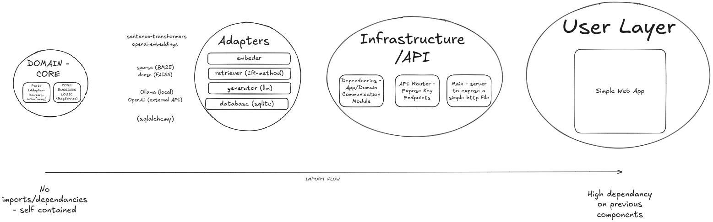

# 🧠 Local-RAG Backend & Frontend

> **Goal**: Retrieval-Augmented Generation Q\&A prototype showcasing (*the best*) architecture, design, implementation, testing, documentation, and scalability practices. Ready to RAG!

---


## Table of Contents

[Summary](#summary)

1. [Project Structure](#1-project-structure)
2. [Why This Design?](#2-why-this-design)
3. [Architecture at a Glance](#3-architecture-at-a-glance)
4. [Quick Start](#4-quick-start)
5. [Configuration](#5-configuration)

---

## Summary

This prototype integrates a comprehensive set of professional standards from design to delivery:

* **Hexagonal Architecture (Ports & Adapters):** separation of domain logic, infrastructure, and API layers, enabling easy component swaps and thorough testability.
* **Modular Project Layout:** Well‑defined directories (`data/`, `frontend/`, `scripts/`, `src/`, `tests/`) aligned with responsibilities.
* **Development Tools & Workflow:**

  * **Python 3+ with Type Hints & Docstrings** for maintainability.
  * **Pre‑commit Hooks & Linting** (Black, isort, Flake8) for consistent code style.
  * **CI/CD Pipeline Templates** (GitHub Actions) prepared for linting, testing, and coverage on each PR.
* **Exhaustive Testing:**

  * **Unit Tests** for core logic and adapters using `pytest`.
  * **Integration Tests** for FastAPI endpoints with `TestClient`, in‑memory DB, and mocked LLMs.
  * **Coverage Metrics** with `pytest‑cov`, targeting > 80 % coverage.
* **Documentation:**

  * **Detailed README** including architecture overview, quick start, configuration, design trade‑offs, and limitations.
  * **Interactive Swagger UI** at `/docs`.
  * **Reserved `docs/` Folder** for diagrams (Mermaid/PlantUML) and advanced guides.
* **Containerization & Orchestration:**

  * **Dockerfile & docker‑compose.yml** for backend (FastAPI + SQLite/FAISS) and optional Ollama service.
  * **Makefile** with common commands (`make test`, `make build-index`).
  * **Environment Management** via `.env` and `python‑dotenv` in `src/settings.py`.
* **Key Components:**

  * **Retrieval Modes:** BM25 (sparse) by default, FAISS (dense) optional, with hybrid fallback.
  * **LLM Adapters:** Abstract `GeneratorPort` with `OpenAIGenerator` and `OllamaGenerator` implementations.
  * **Persistence Layer:** SQLite managed with SQLAlchemy, clear models and CRUD operations, plus `build_index.py` for index generation.
* **Best Practices & Patterns:**

  * **Dependency Injection & Singleton Patterns** for configurable components and test isolation.
  * **Error Handling** for CSV ingestion, DB operations, and LLM calls, with informative logs.
  * **Prepared Logging Hooks** for future integration of monitoring tools.

---

## 1. Project Structure

* `data/`: Contains the input CSV (`faq.csv`) and serves as the default location for the SQLite database and FAISS index.
* `frontend/`: Contains the `index.html` file for the minimal user interface.
* `scripts/`: Includes `build_index.py` for pre‑populating the database and building vector indexes.
* `src/`: The core application code.

  * `adapters/`: Concrete implementations (drivers) for external services or specific algorithms (e.g., BM25, FAISS, OpenAI, Ollama).
  * `app/`: FastAPI application setup, API routing, and dependency injection.
  * `core/`: Domain logic, use cases (e.g., `RagService`), and abstract ports (interfaces). Pure Python.
  * `db/`: SQLAlchemy models, CRUD operations, and database session management.
* `tests/`: Automated tests.

  * `unit/`: Unit tests for individual components.
  * `integration/`: Integration tests for API endpoints.

---

## 2. Why This Design?

| Need (from task)        | Our Reasoning                                      | Implementation Choice                                    |
| :---------------------- | :------------------------------------------------- | :------------------------------------------------------- |
| *Rapid Prototyping*     | Zero external infra; minimal pure‑Python deps.     | SQLite + BM25 (default), FastAPI + Vanilla JS Frontend.  |
| *Scalable Path*         | Ability to swap components without major refactor. | Ports & Adapters (Hexagonal Architecture).               |
| *AI Integration*        | Must work offline **or** with OpenAI.              | `GeneratorPort` → `OpenAIGenerator` / `OllamaGenerator`. |
| *Data Handling*         | Basic knowledge base from CSV.                     | CSV ingested into SQLite; FAISS option for dense search. |
| *Efficient Reviewer UX* | Clone → install → (build index) → test → run.      | `build_index.py` script, `.env`‑based `settings.py`.     |
| *Minimal UI*            | Simple, functional, no heavy frameworks.           | Single `index.html` with vanilla HTML/CSS/JS.            |

---

## 3. Architecture at a Glance

The application follows a Ports & Adapters (Hexagonal) architecture to promote separation of concerns and testability.


**Dependency Rule:** Imports flow inwards toward the `src/core` components, following the Dependency Inversion Principle.


> For a deep dive, see [`docs/architecture.md`](docs/architecture.md).

---

## 4. Quick Start

1. **Create Environment & Install Dependencies:**

   ```bash
   python -m venv .venv
   source .venv/bin/activate  # On Windows: .venv\Scripts\activate
   pip install .
   ```

2. **(Optional) Create `.env` file:**
   Copy `.env.example` to `.env` (if provided) or create a new `.env` file in the project root. Configure your `OPENAI_API_KEY` if you plan to use OpenAI, or set `OLLAMA_ENABLED=true` if you have a local Ollama instance running with the required models.

   ```env
   # OPENAI_API_KEY="sk‑yourkey"
   # OLLAMA_ENABLED=true
   # OLLAMA_MODEL="gemma:2b"
   ```

3. **Initialize Database & Build Index (Recommended):**

   ```bash
   python -m scripts.build_index
   ```

   *The application will also attempt to auto‑populate on first run if the DB is empty.*

4. **Run the Application:**

   ```bash
   uvicorn src.app.main:app --reload --host 0.0.0.0 --port 8000
   ```

   * UI: `http://localhost:8000/`
   * API docs: `http://localhost:8000/docs`

**Docker (Alternative):**

```bash
# Build image
docker build -t local-rag-app .

# Run backend only
docker run -p 8000:8000 -e OPENAI_API_KEY=<key> local-rag-app

# Run with Ollama using compose profile
docker compose --profile with-ollama up --build
```

---

## 5. Configuration

Settings are centralized in `src/settings.py` and can be overridden via environment variables or a `.env` file.

| Variable                 | Default                   | Required?            | Description                            |
| ------------------------ | ------------------------- | -------------------- | -------------------------------------- |
| `APP_HOST`               | `0.0.0.0`                 | No                   | Host IP for FastAPI server.            |
| `APP_PORT`               | `8000`                    | No                   | Port for FastAPI server.               |
| `RETRIEVAL_MODE`         | `sparse`                  | No                   | `sparse`, `dense` or `hybrid`.         |
| `SQLITE_URL`             | `sqlite:///./data/app.db` | No                   | SQLite connection URL.                 |
| `FAQ_CSV`                | `data/faq.csv`            | No                   | Path to FAQ CSV file.                  |
| `CSV_HAS_HEADER`         | `True`                    | No                   | CSV contains header row.               |
| `INDEX_PATH`             | `data/index.faiss`        | Only for dense mode  | Path to FAISS index file.              |
| `ID_MAP_PATH`            | `data/id_map.pkl`         | Only for dense mode  | Path to FAISS ID map.                  |
| `OPENAI_API_KEY`         | —                         | Yes, if using OpenAI | API key for OpenAI completions.        |
| `OPENAI_MODEL`           | `gpt-3.5-turbo`           | No                   | Chat model for OpenAI generator.       |
| `OPENAI_EMBEDDING_MODEL` | `text-embedding-3-small`  | No                   | Embedding model for dense retrieval.   |
| `OPENAI_TEMPERATURE`     | `0.2`                     | No                   | Sampling temperature for OpenAI calls. |
| `OLLAMA_ENABLED`         | `True`                    | No                   | Enable/disable local Ollama generator. |
| `OLLAMA_MODEL`           | `gemma3:4b`               | Only if enabled      | Model name served by Ollama.           |
| `OLLAMA_BASE_URL`        | `http://localhost:11434`  | Only if enabled      | Base URL of Ollama server.             |
| `OLLAMA_REQUEST_TIMEOUT` | `90`                      | No                   | Timeout (s) for Ollama HTTP requests.  |

---

## 6. Running the Application

1. Ensure your `.env` file is configured and dependencies installed.
2. (Recommended) Run the index builder:

   ```bash
   python scripts/build_index.py
   ```
3. Start the FastAPI server:

   ```bash
   uvicorn src.app.main:app --reload --host 0.0.0.0 --port 8000
   ```
4. Access:

   * **UI:** `http://localhost:8000/`
   * **Swagger UI:** `http://localhost:8000/docs`

---

## 7. Running Tests

Activate your virtual environment and run:

```bash
make test
```

This covers:

* Unit tests for core logic and adapters.
* Integration tests for API endpoints with in-memory SQLite and mocked LLMs.

### 7.1. Test Coverage

Generate a detailed HTML report:

```bash
pytest --cov=src --cov-report=html
```

Quick console summary:

```bash
pytest --cov=src
```

File	statements	missing	excluded	branches	partial	coverage
src/adapters/embeddings/openai.py	22	0	0	0	0	100%
src/adapters/embeddings/sentence_transformers.py	9	0	0	0	0	100%
src/adapters/generation/ollama_chat.py	33	2	0	2	0	94%
src/adapters/generation/openai_chat.py	22	0	0	0	0	100%
src/adapters/retrieval/dense_faiss.py	50	9	0	20	7	74%
src/adapters/retrieval/hybrid.py	25	1	0	6	1	94%
src/adapters/retrieval/sparse_bm25.py	46	9	0	12	4	78%
src/app/api_router.py	27	0	0	0	0	100%
src/app/dependencies.py	115	22	0	34	10	79%
src/app/main.py	45	12	0	4	1	69%
src/core/ports.py	14	3	0	0	0	79%
src/core/rag.py	17	0	0	0	0	100%
src/data_loader.py	94	10	0	24	3	89%
src/db/base.py	11	0	0	0	0	100%
src/db/crud.py	19	1	0	2	1	90%
src/db/models.py	12	0	0	0	0	100%
src/settings.py	26	0	0	0	0	100%
src/utils.py	7	0	0	0	0	100%
Total	594	69	0	104	27	86%

---


## 8. API Endpoints

| Method | Path           | Body (JSON)                       | Response (JSON)                                  | Description                               |
| :----: | :------------- | :-------------------------------- | :----------------------------------------------- | :---------------------------------------- |
|  `GET` | `/`            | N/A                               | HTML                                             | Serves the frontend UI.                   |
| `POST` | `/api/ask`     | `{ "question": "str", "k": int }` | `{ "answer": "str", "sources": [ {document, score}, ... ] }` | Returns AI-generated answer & source docs. |
|  `GET` | `/api/history` | Query: `limit`, `offset`          | `[ { "id": int, "question": "str", ... }, ... ]` | Retrieves past Q&A records.               |

*See interactive docs at `/docs` for full details and schemas.*


---

## 9. Design Decisions & Trade-Offs

| Aspect             | Chosen Approach                                                     | Alternatives Considered       | Rationale                                            |
| :----------------- | :------------------------------------------------------------------ | :---------------------------- | :--------------------------------------------------- |
| **Backend**        | Python, FastAPI                                                     | Flask, Django                 | Async support, Pydantic validation, auto docs.       |
| **Frontend**       | Vanilla HTML/CSS/JS                                                 | React, Vue, Jinja2 templates  | Minimal dependencies; rapid prototyping.             |
| **Architecture**   | Ports & Adapters (Hexagonal)                                        | Monolithic, Layered           | Decoupling, testability, swappable components.       |
| **Data Store**     | SQLite                                                              | In-memory list, CSV, Postgres | Simple persistent storage with ORM; zero infra.      |
| **Data Ingestion** | CSV ingested via `build_index.py`                                   | Direct DB input, API upload   | Script allows preprocessing and index building.      |
| **Retrieval**      | BM25 (sparse), FAISS (dense)                                        | TF-IDF, other vector DBs      | BM25 for quick start; FAISS for embedding lookup.    |
| **LLM Interface**  | Abstract `GeneratorPort` with `OpenAIGenerator` & `OllamaGenerator` | Direct SDK calls              | Enables easy switching between local and cloud LLMs. |
| **Testing**        | Pytest, `TestClient`, `unittest.mock`                               | `unittest`                    | Clean syntax, fixtures, built‑in coverage plugins.   |

* **FAISS Index Type:** IndexFlatL2 for fast setup; consider IVF or HNSW for larger corpora (>500k docs).

---

## 10. Known Limitations

* Dense retrieval requires `build_index.py` to be run first.
* Minimal UI without automated frontend tests (manual only).
* No authentication or rate-limiting—unsuitable for open production.
* BM25 and IndexFlatL2 are prototyping choices; scale with Elasticsearch, IVF, HNSW as needed.
* Basic error handling; production demands finer-grained monitoring and retries.
* Timezone handling: `created_at` fields are ISO 8601 strings; UI may need conversion per locale.

---

## 11. Further Reading / Bonus

* Detailed Ports & Adapters guide: `docs/architecture.md`
* Mermaid diagrams: `docs/arch-diagram.png`
* Performance tips for FAISS: see FAISS documentation.

---

*(Made by IntrinsicalAI, Gemini 2.5-05-06, and GPT o3 (v14/05/2025))*
