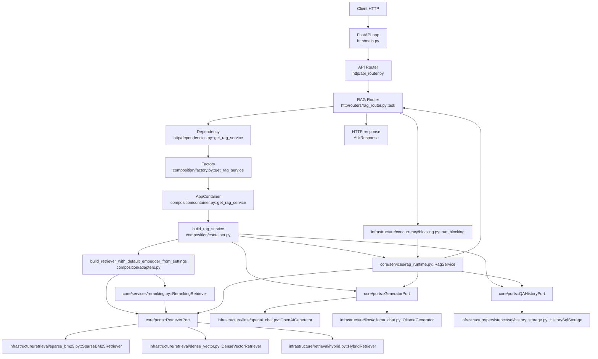
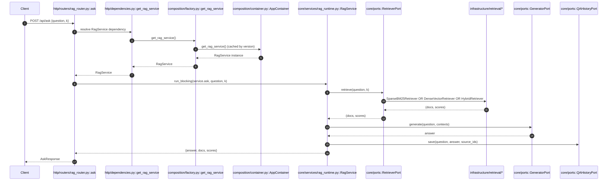

# Intrinsical RAG Prototype

[](https://www.python.org/downloads/)
[](https://fastapi.tiangolo.com)
[](https://opensource.org/licenses/MIT)
[](https://github.com/astral-sh/ruff)
[](https://github.com/Intrinsical-AI/rag-prototype/actions)
[](https://github.com/Intrinsical-AI/rag-prototype)
[](https://hub.docker.com/r/intrinsical/rag-prototype)
<!-- [](https://pypi.org/project/rag-prototype/)
[](https://pypi.org/project/rag-prototype/) -->

> General-purpose RAG system with a hexagonal architecture (Ports & Adapters), FastAPI, four retrieval modes (BM25, dense vector, dual, hybrid), and swappable LLM connectors (OpenAI, OpenRouter, Ollama). Designed as a solid base to iterate in experimental environments.
> Default runtime mode is `sparse` on `local_split` persistence (`SQLite` only). Dense/dual/hybrid can run either on `local_split` (`SQLite + faiss/numpy`) or on a unified Elasticsearch backend.
> The shared `../synergy` workspace may use `elasticsearch` as its default cross-repo profile, but
> this repo keeps `local_split` as its standalone product default.

---

## Key Features

* **Clean architecture**

  * Hexagonal (Ports & Adapters): domain decoupled from infrastructure.
  * Explicit typing and domain models.
* **Retrieval**

  * Sparse: BM25 (offline).
  * Dual: sparse candidate pool with dense rerank.
  * Dense: local vector index (`faiss`/`numpy`) or unified Elasticsearch vector search.
  * Hybrid: local dense+BM25 combination or Elasticsearch lexical+vector fusion.
* **LLMs**

  * OpenAI Chat (via API key).
  * OpenRouter support (as OpenAI-compatible provider and dedicated proxy endpoint).
  * Local Ollama (over HTTP). Current clients are synchronous.
* **Persistence**

  * `local_split`: SQLite via SQLAlchemy for documents/history + on-disk vector index for dense/hybrid.
  * `elasticsearch`: unified documents, vectors, history, system state, and tombstones in Elasticsearch.
* **API**

  * FastAPI with validation and OpenAPI at `/docs`.
  * Public probes: `/healthz`, `/readyz`, Ollama health: `/healthz/ollama`.
  * Config: `/api/config`, Templates: `/api/templates`.
  * OpenRouter proxy (OpenAI-compatible): `POST /api/openrouter/generate`.
* **Tests**

  * Unit, integration, and E2E with `pytest`.

---

## Installation and startup (from source)

```bash
git clone https://github.com/Intrinsical-AI/rag-prototype.git
cd rag-prototype

# Recommended: uv-managed local venv + lockfile installs
# If your environment has a non-writable home directory, keep uv cache local:
# export UV_CACHE_DIR=.uv_cache
uv venv .venv
source .venv/bin/activate
# Windows: .venv\Scripts\activate

# Install runtime deps (uses uv.lock); --extra server adds FastAPI/uvicorn
uv sync --frozen --extra server

# (Optional) Dense/Hybrid deps for local split backend (FAISS)
# uv sync --frozen --extra server --extra dense
#
# (Optional) SentenceTransformers embeddings (heavy: torch/transformers)
# uv sync --frozen --extra dense-st

# (Optional) Dev/Test/Lint groups
# uv sync --frozen --group dev --group test --group lint --no-default-groups
```

Initialize sample data and start:

```bash
# Load sample CSV into the configured backend and, if applicable, build/rebuild retrieval state
rag-bootstrap


# FastAPI server
rag-server
# UI: http://localhost:8000/
# Health: http://localhost:8000/healthz
# Ollama health: http://localhost:8000/healthz/ollama
# Docs: http://localhost:8000/docs
```

> `rag-server` does not accept CLI flags (`--host`, `--port`, etc.). Host and port are controlled
> exclusively via `APP_HOST` / `APP_PORT` environment variables (or `.env`).

> Alternative startup (without `rag-server` wrapper):
> `uvicorn local_rag_backend.http.main:app --reload`.

---


## Configuration

Default `src/local_rag_backend/settings.py` (Pydantic Settings). Overridden with environment variables or a `.env` file (case-insensitive).

> **Security note:** when exposing this service behind a reverse proxy, keep `API_KEY` enabled and ensure the proxy sanitizes forwarding headers.
Runtime auth guards evaluate client origin using `X-Forwarded-For` and RFC 7239 `Forwarded`; untrusted/unsanitized header chains can weaken source attribution. When `API_KEY` is unset and `PUBLIC_BIND_REQUIRES_API_KEY=true`, ambiguous forwarding chains (e.g. empty/unknown-only proxy headers) are rejected fail-closed.


Key variables (non-exhaustive):

| Variable                         | Default                   | Scope        | Description                                            |
| -------------------------------- | ------------------------- | ------------ | ------------------------------------------------------ |
| `APP_HOST`                       | `127.0.0.1`               | server       | Service host                                           |
| `APP_PORT`                       | `8000`                    | server       | Service port                                           |
| `DEBUG`                          | `false`                   | server       | Reload/detailed logging                                |
| `LOG_LEVEL`                      | `INFO`                    | server       | Logging level                                          |
| `API_KEY`                        | —                         | security     | If set, require `X-API-Key: <API_KEY>` for `/api/*` and `/metrics` |
| `PUBLIC_BIND_REQUIRES_API_KEY`   | `true`                    | security     | Refuse unsafe public startup and reject non-local `/api/*` + `/metrics` requests when `API_KEY` is unset |
| `CORS_ALLOW_ORIGINS`             | `[]`                      | security     | Allowed CORS origins when `DEBUG=false` (JSON list or comma-separated) |
| `RETRIEVAL_MODE`                 | `sparse`                  | retrieval    | `sparse` \| `dense` \| `dual` \| `hybrid`              |
| `PERSISTENCE_BACKEND`            | `local_split`             | storage      | `local_split` \| `elasticsearch`                       |
| `SEARCH_BACKEND`                 | `local_split`             | retrieval    | `local_split` \| `elasticsearch` \| `opensearch` \| `solr` — controls query execution backend independently of persistence |
| `DATA_DIR`                       | `data`                    | storage      | Base data directory (SQLite parent, vector index paths) |
| `SQLITE_URL`                     | `sqlite:///./data/app.db` | storage      | SQLite URL                                             |
| `FAQ_CSV`                        | `data/faq.csv`            | ingestion    | Bootstrap CSV path (must exist; no fallback)          |
| `CSV_HAS_HEADER`                 | `true`                    | ingestion    | CSV has header                                         |
| `INGEST_CHUNK_STRATEGY`          | `chars_v1`                | ingestion    | Chunking strategy identifier (deterministic)           |
| `INGEST_CHUNKER_VERSION`         | `chars_v1`                | ingestion    | Version token included in chunk dedup hashes           |
| `INGEST_CHUNK_CHARS`             | `1200`                    | ingestion    | Chunk size in characters (`200..8000`)                 |
| `INGEST_CHUNK_OVERLAP`           | `200`                     | ingestion    | Chunk overlap in characters (`0..4000`, `< CHUNK_CHARS`) |
| `INGEST_BATCH_SIZE`              | `64`                      | ingestion    | File-plans per ingestion batch (`1..512`)              |
| `INGEST_CLEAN_LOWERCASE`         | `true`                    | ingestion    | Lowercase during ingestion preprocessing               |
| `INGEST_CLEAN_REMOVE_HTML`       | `true`                    | ingestion    | Remove HTML tags during ingestion preprocessing        |
| `INGEST_CLEAN_COLLAPSE_WHITESPACE` | `true`                 | ingestion    | Collapse consecutive whitespace                         |
| `INGEST_CLEAN_STRIP`             | `true`                    | ingestion    | Strip leading/trailing whitespace                       |
| `ST_EMBEDDING_MODEL`             | `all-MiniLM-L6-v2`        | dense/hybrid | SentenceTransformers model                             |
| `OPENAI_EMBEDDING_MODEL`         | `text-embedding-3-small`  | OpenAI       | Embeddings model                                       |
| `VECTOR_BACKEND`                 | `auto`                    | local_split  | Vector backend selector: `auto` \| `faiss` \| `numpy` |
| `STORAGE_PROFILE`                | _(auto)_                  | consistency  | Optional explicit storage profile (`sql_only_local`, `sql_faiss_local`, `sql_numpy_local`, `es_unified_dense`, `es_unified_hybrid`) |
| `WRITE_LOCK_TIMEOUT_S`           | `30.0`                    | consistency  | Timeout (seconds) for multi-store write lock           |
| `WRITE_LOCK_POLL_S`              | `0.05`                    | consistency  | Poll interval (seconds) while waiting for lock         |
| `MUTATION_BATCH_MAX_SIZE`        | `32`                      | consistency  | Max queued mutation requests coalesced per batch cycle (`1..512`) |
| `MUTATION_BATCH_MAX_WAIT_MS`     | `50`                      | consistency  | Coalescing wait time before draining a mutation batch (`0..5000`) |
| `MUTATION_RECOVERY_ENABLED`      | `true`                    | consistency  | Enable startup/background replay of incomplete mutations |
| `MUTATION_RECOVERY_INTERVAL_S`   | `30.0`                    | consistency  | Background recovery interval (seconds)                 |
| `INDEX_PATH`                     | `data/index.faiss`        | dense/hybrid | FAISS file                                             |
| `ID_MAP_PATH`                    | `data/id_map.json`        | dense/hybrid | FAISS ID map (JSON)                                    |
| (derived) `index_manifest.json`  | `data/index_manifest.json`| dense/hybrid | Index manifest (model/dim/chunker) for drift detection |
| `ES_BASE_URL`                    | —                         | elasticsearch| Elasticsearch base URL                                 |
| `ES_API_KEY`                     | —                         | elasticsearch| Elasticsearch API key                                  |
| `ES_USERNAME`                    | —                         | elasticsearch| Elasticsearch username                                 |
| `ES_PASSWORD`                    | —                         | elasticsearch| Elasticsearch password                                 |
| `ES_VERIFY_TLS`                  | `true`                    | elasticsearch| Verify TLS certificates                                |
| `ES_REQUEST_TIMEOUT_S`           | `30.0`                    | elasticsearch| HTTP timeout for Elasticsearch                          |
| `ES_DOCS_INDEX`                  | `rag-docs`                | elasticsearch| Documents index                                         |
| `ES_HISTORY_INDEX`               | `rag-history`             | elasticsearch| History index                                           |
| `ES_SYSTEM_INDEX`                | `rag-system`              | elasticsearch| System state / cache invalidation index                |
| `ES_TOMBSTONES_INDEX`            | `rag-tombstones`          | elasticsearch| Tombstones index                                        |
| `ES_CONTENT_FIELD`               | `content`                 | elasticsearch| Text field used for lexical retrieval                   |
| `ES_EMBEDDING_FIELD`             | `embedding`               | elasticsearch| Dense vector field                                      |
| `ES_HYBRID_LEXICAL_K`            | `50`                      | elasticsearch| Lexical candidate pool for hybrid                       |
| `ES_HYBRID_VECTOR_K`             | `50`                      | elasticsearch| Vector candidate pool for hybrid                        |
| `ENABLE_RERANKER`                | `false`                   | retrieval    | Wrap selected retriever with reranking layer           |
| `RERANKER_CANDIDATE_K`           | `20`                      | retrieval    | Candidate set size fetched before reranking (`3..200`) |
| `RERANKER_STRATEGY`              | `overlap_v1`              | retrieval    | Reranker strategy identifier                            |
| `ENABLE_MONITORING`              | `false`                   | monitoring   | Enable metrics middleware and `/metrics` endpoint      |
| `OPENAI_TOP_P`                   | `1.0`                     | OpenAI       | top-p parameter                                        |
| `OPENROUTER_ENABLED`             | `false`                  | OpenRouter   | Enable OpenRouter proxy                                |
| `OPENROUTER_API_KEY`             | —                        | OpenRouter   | API key                                                |
| `OPENROUTER_BASE_URL`            | `https://openrouter.ai/api/v1` | OpenRouter | Base URL                                          |
| `OPENROUTER_MODEL`               | `openai/gpt-4o-mini`     | OpenRouter   | Default model                                         |
| `OPENROUTER_SITE_URL`            | —                        | OpenRouter   | Optional Referer header                                |
| `OPENROUTER_APP_TITLE`           | —                        | OpenRouter   | Optional X-Title header                                |
| `HYBRID_RETRIEVAL_ALPHA`         | `0.5`                     | hybrid       | Weight of the **sparse** component (0=dense, 1=sparse) |
| `DUAL_CANDIDATE_K`               | `50`                      | dual         | Sparse candidate count fetched before dense rerank in `dual` mode (`1..1000`) |
| `OS_BASE_URL`                    | —                         | opensearch   | OpenSearch base URL (required when `SEARCH_BACKEND=opensearch`) |
| `OS_API_KEY`                     | —                         | opensearch   | OpenSearch API key |
| `OS_USERNAME`                    | —                         | opensearch   | OpenSearch username |
| `OS_PASSWORD`                    | —                         | opensearch   | OpenSearch password |
| `OS_VERIFY_TLS`                  | `true`                    | opensearch   | Verify TLS certificates |
| `OS_REQUEST_TIMEOUT_S`           | `30.0`                    | opensearch   | HTTP timeout (seconds) |
| `OS_DOCS_INDEX`                  | `rag-docs`                | opensearch   | Documents index |
| `OS_CONTENT_FIELD`               | `content`                 | opensearch   | Lexical retrieval field |
| `OS_EMBEDDING_FIELD`             | `embedding`               | opensearch   | Dense vector field |
| `OS_DENSE_CANDIDATE_K`           | `50`                      | opensearch   | Vector candidate pool for dense retrieval (`1..1000`) |
| `SOLR_BASE_URL`                  | —                         | solr         | Solr base URL (required when `SEARCH_BACKEND=solr`) |
| `SOLR_CORE`                      | `rag-docs`                | solr         | Solr core/collection for documents |
| `SOLR_CONTENT_FIELD`             | `content`                 | solr         | Content field name |
| `SOLR_REQUEST_TIMEOUT_S`         | `30.0`                    | solr         | HTTP timeout (seconds). Only `sparse` retrieval is supported in v1 |
| `OPENAI_API_KEY`                 | —                         | OpenAI       | API key                                                |
| `OPENAI_MODEL`                   | `gpt-4o-mini`             | OpenAI       | Chat model                                             |
| `OPENAI_REQUEST_TIMEOUT`         | `60`                      | OpenAI       | Timeout (s) for OpenAI-compatible HTTP requests        |
| `OPENAI_TEMPERATURE`             | `0.2`                     | OpenAI       | Temperature                                            |
| `OPENAI_MAX_TOKENS`              | `256`                     | OpenAI       | Max tokens                                             |
| `OPENAI_PROMPT_TEMPLATE`         | _(builtin template)_      | prompting    | Prompt template for OpenAI/OpenRouter generators       |
| `OLLAMA_ENABLED`                 | `false`                   | Ollama       | Enable Ollama                                          |
| `OLLAMA_MODEL`                   | `lfm2.5-thinking`               | Ollama       | Model served by Ollama                                 |
| `OLLAMA_BASE_URL`                | `http://localhost:11434`  | Ollama       | Server URL                                             |
| `OLLAMA_REQUEST_TIMEOUT`         | `180`                     | Ollama       | Timeout (s)                                            |
| `OLLAMA_PROMPT_TEMPLATE`         | _(builtin template)_      | prompting    | Prompt template for Ollama generator                   |


### Backend matrix

| `PERSISTENCE_BACKEND` | `SEARCH_BACKEND` | Retrieval modes | Canonical write model | Notes |
| --- | --- | --- | --- | --- |
| `local_split` | `local_split` (default) | `sparse`, `dense`, `dual`, `hybrid` | `DURABLE_SAGA` | `sparse`/`dual` are SQLite-only; dense/hybrid add local vector state |
| `elasticsearch` | `elasticsearch` | `sparse`, `dense`, `hybrid` | `ATOMIC` | Unified docs/history/vectors/system-state/tombstones in Elasticsearch |
| `local_split` | `opensearch` | `sparse`, `dense` | `DURABLE_SAGA` | SQL persistence + OpenSearch for query execution; `hybrid` not supported |
| `local_split` | `solr` | `sparse` | `DURABLE_SAGA` | SQL persistence + Solr for lexical retrieval only; dense/dual not supported in v1 |

`PERSISTENCE_BACKEND=elasticsearch` with `RETRIEVAL_MODE=sparse` is only valid when `SEARCH_BACKEND=elasticsearch`; otherwise rejected at startup.

### Index manifest (`local_split` dense/hybrid only)

When `PERSISTENCE_BACKEND=local_split` and `RETRIEVAL_MODE=dense|hybrid`, the system writes an `index_manifest.json` next to `INDEX_PATH`.
It records stable identifiers for the index build (embedding backend/model, dimension, chunker strategy/version).

If you change any of these settings, `/readyz` and `rag-status` will report drift and instruct you to rebuild:
`rag-rebuild-index` (or `POST /api/index/rebuild`).

**Note:**  **fresh-install only** storage contract.
* canonical document IDs are opaque strings (`doc:<uuid7>`)
* SQL documents use `doc_id` as the primary key
* vector `id_map.json` stores `list[str]`
* no runtime migration/fallback for legacy schemas or legacy id maps

### Retrieval adapter resolution (strict)

* `RETRIEVAL_MODE=sparse`:
  `RetrieverPort := SparseBM25Retriever` (BM25 corpus + SQL doc repo)
* `PERSISTENCE_BACKEND=local_split` and `RETRIEVAL_MODE=dense`:
  `RetrieverPort := DenseVectorRetriever` (embedder + local vector index + SQL doc repo)
* `PERSISTENCE_BACKEND=local_split` and `RETRIEVAL_MODE=hybrid`:
  `RetrieverPort := HybridRetriever(DenseVectorRetriever, SparseBM25Retriever, alpha)`
* `PERSISTENCE_BACKEND=elasticsearch` and `RETRIEVAL_MODE=dense`:
  `RetrieverPort := DenseVectorRetriever` (embedder + Elasticsearch vector repo + ES doc repo)
* `PERSISTENCE_BACKEND=elasticsearch` and `RETRIEVAL_MODE=hybrid`:
  `RetrieverPort := HybridRetriever(DenseVectorRetriever, Elastic lexical retriever, alpha)`
* If `ENABLE_RERANKER=true`, the selected retriever is wrapped as:
  `RetrieverPort := RerankingRetriever(base=<selected>)`

This boundary is enforced in `composition/adapters.py` and consumed by `AppContainer`.


---

## Ingestion and indexing flow

The ingestion process is orchestrated by `IngestionPipeline`:

1. Load items from a `LoaderPort` (e.g., `CSVLoader`) returning `LoadedItem(text, lineage, metadata)`.
2. Preprocess (`preprocess_text`) and chunk (`default_chunker`) with overlap.
3. Format chunks (metadata header) and batch-ingest via `ETLService.ingest()`.

### CLI support

* **Sparse**: stores directly in SQLite (no embeddings required).
* **Dense / Hybrid on `local_split`**:
  1. Save chunks in SQLite
  2. Generate embeddings with OpenAI (if `OPENAI_API_KEY`) or SentenceTransformers (`ST_EMBEDDING_MODEL`)
  3. Upsert into the vector index (`INDEX_PATH`, `ID_MAP_PATH`)
* **Dense / Hybrid on `elasticsearch`**:
  1. Generate embeddings for changed chunks
  2. Upsert documents and embeddings atomically by `external_id`
  3. Use native Elasticsearch lexical/vector retrieval for runtime queries

Chunking parameters (in settings):

* `INGEST_CHUNK_CHARS` (default 1200)
* `INGEST_CHUNK_OVERLAP` (default 200)
* `INGEST_CHUNKER_VERSION` (default `chars_v1`): changes the dedup key used by `/api/docs` to force re-chunk/re-embed.
* `INGEST_BATCH_SIZE` (default `64`, valid range `1..512`): file-plans processed per ingestion batch.

Available scripts:

```bash
# Ingest from CSV and build vector index if applicable
rag-bootstrap


# Ingest .txt/.md/.csv from file(s) or directory(ies)
rag-ingest ./my_notes ./docs/handbook.md ./data/faq.csv

# Keep symlink targets out of scope (also skips symlink paths passed as root inputs)
rag-ingest --no-follow-symlinks ./docs


# Rebuild retrieval state from the current document store (idempotent; dense/dual/hybrid only)
rag-rebuild-index


# Unified docs mutation (canonical write path)
cat > /tmp/mutate_upsert.json <<'JSON'
{"op_id":"op-upsert-1","upserts":[{"external_id":"doc-1","content":"hello"}]}
JSON
rag-mutate-docs --json /tmp/mutate_upsert.json

# Canonical external import/sync (e.g. RepoGPT code-units)
cat > /tmp/canonical_import.json <<'JSON'
{"scope":"repogpt:demo","snapshot_id":"snap-1","documents":[{"external_id":"repogpt:demo:1","source_id":"repogpt:demo:file:src/app.py","content":"def hello():\n    return 1\n","metadata":{"path":"src/app.py","unit_type":"function"}}]}
JSON
rag-import-canonical --json /tmp/canonical_import.json

# Delete by SQL doc IDs
cat > /tmp/mutate_delete_ids.json <<'JSON'
{"op_id":"op-del-ids-1","delete_ids":["doc:...","doc:..."]}
JSON
rag-mutate-docs --json /tmp/mutate_delete_ids.json

# Delete by external IDs (creates tombstones)
cat > /tmp/mutate_delete_external_ids.json <<'JSON'
{"op_id":"op-del-ext-1","delete_external_ids":["chunk:abcd...","file:/path:part=file:chunk=0"]}
JSON
rag-mutate-docs --json /tmp/mutate_delete_external_ids.json


# Summarized system and files status
rag-status


# Offline IR evaluation with standard metrics via `ir_measures`
# Uses an isolated local eval runtime; does not touch the main doc store or index.
rag-eval --retrieval-mode sparse
rag-eval --retrieval-mode dense --candidate-k 20
rag-eval --retrieval-mode dual --dual-candidate-k 50
rag-eval --retrieval-mode hybrid --hybrid-alpha 0.5
rag-eval-compare --candidate-mode dual --candidate-dual-candidate-k 50
cat > /tmp/rag-eval-batch-specs.json <<'JSON'
[{"name":"sparse-baseline","retrieval_mode":"sparse","k":3},{"name":"dual-50","retrieval_mode":"dual","k":3,"dual_candidate_k":50}]
JSON
rag-eval-batch --specs /tmp/rag-eval-batch-specs.json --fresh-eval-workspace

# Shared cross-repo RepoGPT demo/eval pack lives in synergy root
../synergy/synergy-up-search
bash ../synergy/scripts/repogpt_ingest_demo.sh
bash ../synergy/scripts/repogpt_eval_smoke.sh
bash ../synergy/scripts/repogpt_ingest_demo.sh --profile local_split
```

> Retrieval mode is selected via `RETRIEVAL_MODE` (there is no `--mode` flag).

RepoGPT integration pack:

* Shared fixture repo: `../synergy/fixtures/repogpt_eval_repo/`
* Cross-repo demos/smokes: `../synergy/scripts/repogpt_ingest_demo.sh`, `../synergy/scripts/repogpt_eval_smoke.sh`
* `../synergy` uses `elasticsearch` as the default workspace profile; this repo does not.
* Consumer-owned eval dataset: `datasets/repogpt_rag_eval_v1.jsonl`
* Maintained import/search coverage: `tests/e2e/test_repogpt_ingest_search_eval.py`

Vulnerability pilot pack:

* Shared prepared snapshot: `../synergy/vuln_pilot/prepared/pilot_small_v1.jsonl`
* Cross-repo batch/import scripts: `../synergy/scripts/vulns_batch_triage.py`, `../synergy/scripts/vulns_ingest_rag.py`
* Consumer-owned eval dataset: `datasets/vuln_pilot_rag_eval_v1.jsonl`
* Maintained import/search coverage: `tests/e2e/test_vuln_pilot_ingest_search_eval.py`

Optional: better file type detection (best-effort) using `python-magic`:

```bash
uv sync --frozen --extra magic
# or: pip install rag-prototype[magic]
```

`rag-ingest` detection is Unicode-aware (UTF-8 text with non-ASCII characters is accepted) and
handles unreadable files as best-effort skips instead of aborting the full ingestion run.

Optional: Prometheus metrics (`/metrics`) and structured-ish domain metrics:

```bash
uv sync --frozen --extra monitoring
# then:
export ENABLE_MONITORING=true
rag-server
```

Optional: performance extras (`torch` + `orjson` for faster JSON serialization):

```bash
uv sync --frozen --extra performance      # torch + orjson (CPU)
uv sync --frozen --extra performance-cpu  # alias, identical to performance
```

These extras are included in `all` but are **not required** for sparse or dense retrieval. Install only when you have profiled a serialization or inference bottleneck that justifies the `torch` dependency weight.

Optional: reranker (retrieval quality knob, measurable via `rag-eval`):

```bash
export ENABLE_RERANKER=true
export RERANKER_CANDIDATE_K=20
```


### Run with Docker Compose (including Ollama)

```bash
# Build and start backend + Ollama
docker compose up -d --build

# (Optional) Pull a model into Ollama once the service is up
docker exec -it ollama ollama pull lfm2.5-thinking

# Verify services
curl http://localhost:8000/healthz
curl http://localhost:8000/healthz/ollama
```

Notes:
- Backend listens on `8000`, Ollama on `11434`.
- Configure providers via `.env` or environment variables (see `.env.example`).
- In `docker-compose.yml`, `OLLAMA_ENABLED=true` and `OLLAMA_BASE_URL=http://ollama:11434` are set.
- `docker-compose.yml` defaults to `PERSISTENCE_BACKEND=local_split` and `RETRIEVAL_MODE=sparse` for a lightweight image.
- For `local_split` dense/hybrid in compose, build backend with extras, for example:

```bash
docker compose build --build-arg RAG_EXTRAS=dense rag-backend
# add dense-st too if you need SentenceTransformers:
# docker compose build --build-arg RAG_EXTRAS=dense,dense-st rag-backend
docker compose up -d
```

> Docker build expectations (CI parity). Recommended local verification: `docker build --target production .`


---

## Project structure

```bash
.
├── data/                      # CSV, SQLite DB, vector index files
├── src/local_rag_backend/
│   ├── core/                  # domain, ports, services, use cases
│   │   ├── domain/            # entities, types, storage profiles
│   │   ├── ports/             # abstract contracts (Protocol-based)
│   │   ├── services/          # domain services (ETL, RAG runtime, reranking)
│   │   └── use_cases/         # application use cases (ingest, query, mutation, …)
│   ├── infrastructure/        # adapters: llms, retrievers, storage, loaders, observability
│   ├── composition/           # DI container, factory, wiring (transport-neutral)
│   ├── http/                  # FastAPI transport adapter (routers, schemas, middleware)
│   ├── cli_commands/          # CLI transport adapters (ingest, mutate, eval, …)
│   ├── scripts/               # internal scripts (sample data ingestion)
│   └── frontend/              # packaged index.html to serve at /
└── tests/                     # unit + integration + e2e
```

### Extension and integration points

* **LLM**: implement `GeneratorPort` (see `infrastructure/llms/*`) and wire it in `composition/factory.py`.
* **Retriever**: implement `RetrieverPort` and wire it through `composition/adapters.py` (`build_retriever_from_settings` / `build_retriever_with_default_embedder_from_settings`).
* **Vector store**: implement `VectorRepoPort` (e.g., an alternative to FAISS).
* **Document store**: implement `DocumentRepoPort` to use a DB other than SQLite.
* **Loader**: implement `LoaderPort` for new sources (PDFs, web, etc.).


## API

* `GET /` → Serves packaged `index.html` or the source tree `src/local_rag_backend/frontend/index.html`.
* `GET /healthz` and `GET /readyz`
* `GET /healthz/ollama`
* `GET /api/config` and `GET /api/templates`
* `POST /api/ask`
  * Body: `{ "question": "str", "k": int (1..10, default 3), "filters": [{"field":"scope|snapshot_id|source_id|metadata.<key>","values":["..."]}] }`
  * Response: `{ "answer": "str", "sources": [ { "document": {"id": "doc:...", "content": "str", "external_id": "str|null", "source_id": "str|null", "metadata": {...}|null}, "score": float(0..1) }, ... ] }`
* `POST /api/ask_eval` (ephemeral per-request RAG config for retrieval/generator evaluation)
* `GET /api/history?limit=1..100&offset>=0`

* Response: list of `{ id, question, answer, created_at, source_ids[] }` where `source_ids` are string document IDs
* FastAPI docs: `GET /docs` and `GET /openapi.json`
* `POST /api/docs` (ingest texts)
* `POST /api/docs/query` (list/query documents with structured filters)
* `POST /api/docs/import` (ingest conversations from ChatGPT/Gemini export JSON)
* `POST /api/docs/mutate` (canonical unified docs mutation: upserts, delete_ids, delete_external_ids)
* `POST /api/docs/import-canonical` (scope/snapshot import for external producers such as RepoGPT)
* `POST /api/index/rebuild` (idempotent rebuild of retrieval state from the canonical document store; dense/dual/hybrid only)
* `POST /api/openrouter/generate` (enabled if OpenRouter configured)

Notes:

* Retrieval “scores” are normalized to [0,1] in the adapters.
* The service persists each Q/A with the IDs of the retrieved sources (best-effort; retrieval/answer response is not blocked if history persistence fails).
* For `/api/ask`, default provider selection is `ollama` -> `openai` -> `openrouter` depending on active configuration.
* In dense/dual/hybrid mode, write via `/api/docs/mutate`, `/api/docs/import-canonical`, `rag-mutate-docs`, or `rag-import-canonical` rather than mutating stores independently.
* `local_split` uses `MutationCoordinator` with `DURABLE_SAGA`: SQL commit + vector delta (`apply_delta_atomic`) + journaled compensation/recovery.
* `elasticsearch` uses `MutationCoordinator` with an atomic backend path: document, vector, history, system-state, and tombstone semantics are unified in Elasticsearch.
* Full rebuild is an explicit repair operation only (`/api/index/rebuild` or `rag-rebuild-index`), not a normal write fallback.
* v1.0 removed legacy write endpoints: `/api/docs/upsert`, `/api/docs/delete`, `/api/docs/delete_by_external_id`.
* In `local_split` dense/dual/hybrid mode, `/readyz` is intentionally strict and returns `503` when it detects missing/corrupt index files or drift between SQLite documents and the vector index.
* In `elasticsearch` mode, `/readyz` validates backend connectivity, index existence, mapping dimensions, and embedded-document counts.
* For public/proxy deployments, use `API_KEY` and sanitize `X-Forwarded-For` / `Forwarded` at the edge proxy.

Example:

```bash
curl -X POST "http://localhost:8000/api/ask" \
  -H "Content-Type: application/json" \
  -d '{"question": "What is RAG?", "k": 3, "filters":[{"field":"metadata.unit_type","values":["function"]}]}'
```

---

## Strict Request-Flow Architecture (`/api/ask`)

The following diagram maps the real runtime path of a request from
`src/local_rag_backend/http/routers/rag_router.py` to `core/ports` and into
`infrastructure/retrieval`.


```mermaid
flowchart TD
    C[Client HTTP] --> M[FastAPI app\nhttp/main.py]
    M --> AR[API Router\nhttp/api_router.py]
    AR --> RR[RAG Router\nhttp/routers/rag_router.py::ask]

    RR --> D1[Dependency\nhttp/dependencies.py::get_rag_service]
    D1 --> F1[Factory\ncomposition/factory.py::get_rag_service]
    F1 --> AC[AppContainer\ncomposition/container.py::get_rag_service]
    AC --> BRS[build_rag_service\ncomposition/container.py]

    BRS --> RS[core/services/rag_runtime.py::RagService]

    BRS --> COMP[build_retriever_with_default_embedder_from_settings\ncomposition/adapters.py]
    COMP --> RP[core/ports::RetrieverPort]
    RP --> SBR[infrastructure/retrieval/sparse_bm25.py::SparseBM25Retriever]
    RP --> DFR[infrastructure/retrieval/dense_vector.py::DenseVectorRetriever]
    RP --> HR[infrastructure/retrieval/hybrid.py::HybridRetriever]
    COMP --> RER[core/services/reranking.py::RerankingRetriever]
    RER --> RP

    BRS --> GP[core/ports::GeneratorPort]
    GP --> OAI[infrastructure/llms/openai_chat.py::OpenAIGenerator]
    GP --> OLL[infrastructure/llms/ollama_chat.py::OllamaGenerator]

    BRS --> HP[core/ports::QAHistoryPort]
    HP --> HSQL[infrastructure/persistence/sql/history_storage.py::HistorySqlStorage]

    RR --> RB[infrastructure/concurrency/blocking.py::run_blocking]
    RB --> RS
    RS --> RP
    RS --> GP
    RS --> HP
    RS --> RR
    RR --> RESP[HTTP response\nAskResponse]
```

### Strict sequence (runtime)


```mermaid
sequenceDiagram
    autonumber
    participant Client
    participant Router as http/routers/rag_router.py::ask
    participant Dep as http/dependencies.py::get_rag_service
    participant Factory as composition/factory.py::get_rag_service
    participant Container as composition/container.py::AppContainer
    participant RagService as core/services/rag_runtime.py::RagService
    participant Retriever as core/ports::RetrieverPort
    participant InfraRet as infrastructure/retrieval/*
    participant Gen as core/ports::GeneratorPort
    participant Hist as core/ports::QAHistoryPort

    Client->>Router: POST /api/ask {question, k}
    Router->>Dep: resolve RagService dependency
    Dep->>Factory: get_rag_service()
    Factory->>Container: get_rag_service() (cached by version)
    Container-->>Factory: RagService instance
    Factory-->>Dep: RagService
    Dep-->>Router: RagService

    Router->>RagService: run_blocking(service.ask, question, k)
    RagService->>Retriever: retrieve(question, k)
    Retriever->>InfraRet: SparseBM25Retriever OR DenseVectorRetriever OR HybridRetriever
    InfraRet-->>Retriever: (docs, scores)
    Retriever-->>RagService: (docs, scores)

    RagService->>Gen: generate(question, contexts)
    Gen-->>RagService: answer
    RagService->>Hist: save(question, answer, source_ids)
    RagService-->>Router: {answer, docs, scores}
    Router-->>Client: AskResponse
```


---

### Type boundaries

* `http/schemas/*`: HTTP request/response contracts (Pydantic transport layer).
* `core/use_cases/results.py`: use-case outputs shared by API/CLI.
* `core/services/types.py`: transport-agnostic core DTOs (chunking/eval/detection).
* `core/domain/entities.py`: domain entities and business invariants.
* `infrastructure/persistence/*/models.py`: ORM persistence models.

---


## Current limitations

* Synchronous LLM clients (httpx/OpenAI SDK); migration to async is straightforward but not included.
* Minimal UI without front-end tests.
* Minimal API-key auth is available (`API_KEY`), but there is no user/role authZ or rate limiting.
* When using the FAISS backend, the index type is `IndexFlatL2` (simple). For large volumes, consider IVF/HNSW or other backends.

## Runtime considerations

* **Singleton per process**: `RagService` is initialized as a singleton in `composition/factory`. With `uvicorn --workers N`, each process loads its own instance (and its retrieval/index adapters). Align deployment and warm-up as needed.
* **Cross-process coordination files**: multi-store write lock and RAG reload token are stored in a shared coordination directory (`Settings.get_coordination_dir()`), preferring explicit `DATA_DIR`; when `DATA_DIR` is default and `SQLITE_URL` is absolute, it uses the DB parent directory to keep workers/CLI aligned.
* **Metrics**: if `ENABLE_MONITORING=true` and `prometheus-client` is installed, `/metrics` provides Prometheus format.
* **Dense/Hybrid**: must use the same embedding model for indexing and querying (`ST_EMBEDDING_MODEL`).

## Tests

```bash
UV_CACHE_DIR=.uv_cache uv sync --frozen --group test --group lint --extra server --no-default-groups
UV_CACHE_DIR=.uv_cache uv run --active --no-sync pytest -q
UV_CACHE_DIR=.uv_cache uv run --active --no-sync ruff check src tests
PYTHONPATH=src UV_CACHE_DIR=.uv_cache uv run --active --no-sync lint-imports
uv run pre-commit run --all-files
```

> Test suite includes unit, integration, and E2E (FastAPI TestClient). The vector layer defaults to `VECTOR_BACKEND=auto` (FAISS when available, NumPy fallback otherwise), and many tests use stubs/mocks for external providers. The suite enforces `--cov-fail-under=85` via `pyproject.toml`.

### CI gates

Current CI gates include:

- `pre-commit run --all-files`
- `ruff check src tests` and `ruff format --check src tests`
- `mypy src`
- architecture guardrails: `pytest -q -o addopts='' tests/architecture/test_*.py`
- `lint-imports` (macro architecture contracts via `.importlinter`)
- tests on Python `3.11` and `3.12` (Ubuntu) plus Windows smoke tests
- security scan job (`bandit` + `safety` report generation)
- Docker build for `--target production` on `main/master`

Workflow trigger note:
- PRs/commits that only change docs (`**/*.md`, `docs/**`) do not trigger CI due to `paths-ignore` in `.github/workflows/ci.yml`.
- Run local validation manually for doc-only changes when they alter architecture/API/operations guidance.

For local parity, use:

```bash
make lint
make lint-imports
make type
make test
make sec        # strict
make sec-soft   # non-blocking local audit
```

## See also: LangChainLoader
You can ingest data from any LangChain document loader via the `LangChainLoader` adapter, which implements the project's `LoaderPort`.

Installation:

```bash
uv sync --frozen --extra loaders
# or when installing from PyPI:
# pip install rag-prototype[loaders]
```

Quick usage example:

```python
from langchain_community.document_loaders import WebBaseLoader
from local_rag_backend.core.services.etl import ETLService
from local_rag_backend.core.services.ingestion import IngestionPipeline
from local_rag_backend.infrastructure.ingestion.loaders import LangChainLoader

# 1) Create/obtain your ETLService as usual (doc store, vector store, embedder)
etl = ETLService(doc_repo, vector_repo, embedder)

# 2) Wrap any LangChain loader
lc_loader = WebBaseLoader(["https://example.com"])  # or DirectoryLoader, SitemapLoader, etc.
loader = LangChainLoader(lc_loader, drop_empty=True, metadata_filter={"lang": "en"})

# 3) Run the pipeline
pipeline = IngestionPipeline(loader=loader, etl_service=etl)
count = pipeline.run()
print(f"Ingested {count} chunks")
```

Notes:

- `drop_empty=True` skips whitespace-only documents.
- `metadata_filter={...}` yields only items whose metadata includes the given key/value pairs.
- The adapter expects each LangChain `Document` to have `page_content` and `metadata` fields. It gracefully falls back to dict-like objects or stringification when needed.

---

## License

MIT. See [LICENSE](LICENSE) file for details.

---

<div align="center">

**Built with ❤️ by [Intrinsical AI](https://python-lair.space) & Co.**

</div>
