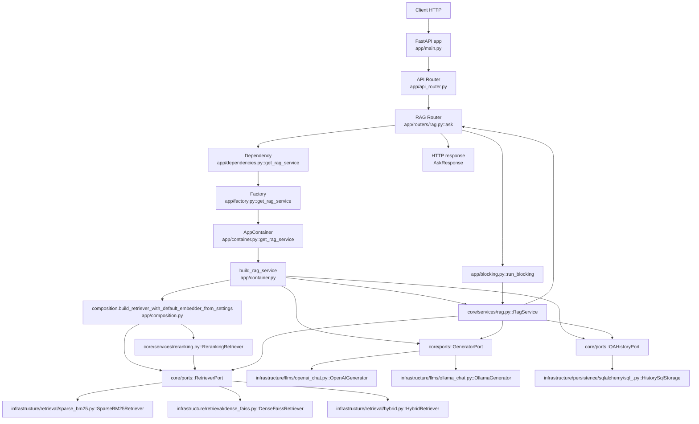
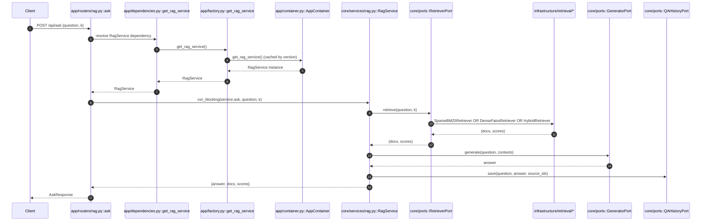

# Intrinsical RAG Prototype

[](https://www.python.org/downloads/)
[](https://fastapi.tiangolo.com)
[](https://opensource.org/licenses/MIT)
[](https://github.com/astral-sh/ruff)
[](https://github.com/Intrinsical-AI/rag-prototype/actions)
[](https://github.com/Intrinsical-AI/rag-prototype)
[](https://hub.docker.com/r/intrinsical/rag-prototype)
[](https://pypi.org/project/rag-prototype/)
[](https://pypi.org/project/rag-prototype/)

> General-purpose RAG system with a hexagonal architecture (Ports & Adapters), FastAPI, three retrieval modes (BM25, FAISS, hybrid), and swappable LLM connectors (OpenAI or Ollama). Designed as a solid base to iterate in real development environments.

---

## Features

* **Clean architecture**

  * Hexagonal (Ports & Adapters): domain decoupled from infrastructure.
  * Explicit typing and domain models.
* **Retrieval**

  * Sparse: BM25 (offline).
  * Dense: FAISS + SentenceTransformers.
  * Hybrid: dense + BM25 combination with configurable weight.
* **LLMs**

  * OpenAI Chat (via API key).
  * Local Ollama (over HTTP). Current clients are synchronous.
* **Persistence**

  * SQLite via SQLAlchemy: documents and Q\&A history.
  * FAISS on disk for dense/hybrid mode.
* **API**

  * FastAPI with validation and OpenAPI at `/docs`.
  * Health: `/api/health`, Readiness: `/api/ready`, Ollama health: `/api/health/ollama`.
  * Config: `/api/config`, Templates: `/api/templates`.
  * OpenRouter proxy (OpenAI-compatible): `POST /api/openrouter/generate`.
* **Tests**

  * Unit, integration, and E2E with `pytest`.

---

## Project structure

```bash
.
├── data/                      # CSV, SQLite DB, FAISS files
├── src/local_rag_backend/
│   ├── app/                   # FastAPI (main, routers, DI, factory)
│   ├── core/                  # domain, ports and services (ETL, RAG)
│   ├── infrastructure/        # adapters: llms, retrievers, storage, loaders
│   ├── scripts/               # bootstrap and build_index
│   └── frontend/              # packaged index.html to serve at /
└── tests/                     # unit + integration + e2e
```

---

## Strict Request-Flow Architecture (`/api/ask`)

The following diagram maps the real runtime path of a request from
`src/local_rag_backend/app/routers/rag.py` to `core/ports` and into
`infrastructure/retrieval`.


```mermaid
flowchart TD
    C[Client HTTP] --> M[FastAPI app\napp/main.py]
    M --> AR[API Router\napp/api_router.py]
    AR --> RR[RAG Router\napp/routers/rag.py::ask]

    RR --> D1[Dependency\napp/dependencies.py::get_rag_service]
    D1 --> F1[Factory\napp/factory.py::get_rag_service]
    F1 --> AC[AppContainer\napp/container.py::get_rag_service]
    AC --> BRS[build_rag_service\napp/container.py]

    BRS --> RS[core/services/rag.py::RagService]

    BRS --> COMP[composition.build_retriever_with_default_embedder_from_settings\napp/composition.py]
    COMP --> RP[core/ports::RetrieverPort]
    RP --> SBR[infrastructure/retrieval/sparse_bm25.py::SparseBM25Retriever]
    RP --> DFR[infrastructure/retrieval/dense_faiss.py::DenseFaissRetriever]
    RP --> HR[infrastructure/retrieval/hybrid.py::HybridRetriever]
    COMP --> RER[core/services/reranking.py::RerankingRetriever]
    RER --> RP

    BRS --> GP[core/ports::GeneratorPort]
    GP --> OAI[infrastructure/llms/openai_chat.py::OpenAIGenerator]
    GP --> OLL[infrastructure/llms/ollama_chat.py::OllamaGenerator]

    BRS --> HP[core/ports::QAHistoryPort]
    HP --> HSQL[infrastructure/persistence/sqlalchemy/sql_.py::HistorySqlStorage]

    RR --> RB[app/blocking.py::run_blocking]
    RB --> RS
    RS --> RP
    RS --> GP
    RS --> HP
    RS --> RR
    RR --> RESP[HTTP response\nAskResponse]
```

### Strict sequence (runtime)


```mermaid
sequenceDiagram
    autonumber
    participant Client
    participant Router as app/routers/rag.py::ask
    participant Dep as app/dependencies.py::get_rag_service
    participant Factory as app/factory.py::get_rag_service
    participant Container as app/container.py::AppContainer
    participant RagService as core/services/rag.py::RagService
    participant Retriever as core/ports::RetrieverPort
    participant InfraRet as infrastructure/retrieval/*
    participant Gen as core/ports::GeneratorPort
    participant Hist as core/ports::QAHistoryPort

    Client->>Router: POST /api/ask {question, k}
    Router->>Dep: resolve RagService dependency
    Dep->>Factory: get_rag_service()
    Factory->>Container: get_rag_service() (cached by version)
    Container-->>Factory: RagService instance
    Factory-->>Dep: RagService
    Dep-->>Router: RagService

    Router->>RagService: run_blocking(service.ask, question, k)
    RagService->>Retriever: retrieve(question, k)
    Retriever->>InfraRet: SparseBM25Retriever OR DenseFaissRetriever OR HybridRetriever
    InfraRet-->>Retriever: (docs, scores)
    Retriever-->>RagService: (docs, scores)

    RagService->>Gen: generate(question, contexts)
    Gen-->>RagService: answer
    RagService->>Hist: save(question, answer, source_ids)
    RagService-->>Router: {answer, docs, scores}
    Router-->>Client: AskResponse
```

### Retrieval adapter resolution (strict)

* `RETRIEVAL_MODE=sparse`:
  `RetrieverPort := SparseBM25Retriever` (BM25 corpus + SQL doc repo)
* `RETRIEVAL_MODE=dense`:
  `RetrieverPort := DenseFaissRetriever` (embedder + FAISS + SQL doc repo)
* `RETRIEVAL_MODE=hybrid`:
  `RetrieverPort := HybridRetriever(DenseFaissRetriever, SparseBM25Retriever, alpha)`
* If `ENABLE_RERANKER=true`, the selected retriever is wrapped as:
  `RetrieverPort := RerankingRetriever(base=<selected>)`

This boundary is enforced in `app/composition.py` and consumed by `AppContainer`.

---

## Docs

* `docs/architecture.md`
* `docs/custom_usage_guide.md`
* `docs/langchain_loaders.md`

---

## Requirements

* Python 3.11+
* Operating system: Linux / macOS / Windows
* For dense/hybrid mode: install the `dense` extra (FAISS). For SentenceTransformers embeddings, also install `dense-st`.

---

## Installation and startup (from source)

```bash
git clone https://github.com/Intrinsical-AI/rag-prototype.git
cd rag-prototype

# Recommended: uv-managed local venv + lockfile installs
# If your environment has a non-writable home directory, keep uv cache local:
# export UV_CACHE_DIR=.uv_cache
uv venv .venv
source .venv/bin/activate
# Windows: .venv\Scripts\activate

# Install runtime deps (uses uv.lock)
uv sync --frozen

# (Optional) Dense/Hybrid deps (FAISS)
# uv sync --frozen --extra dense
#
# (Optional) SentenceTransformers embeddings (heavy: torch/transformers)
# uv sync --frozen --extra dense-st

# (Optional) Dev/Test/Lint deps
# uv sync --frozen --extra dev --extra test --extra lint
```

Initialize sample data and start:

```bash
# Load sample CSV into SQLite and, if applicable, build FAISS
rag-bootstrap


# FastAPI server
rag-server
# UI: http://localhost:8000/
# Health: http://localhost:8000/api/health
# Ollama health: http://localhost:8000/api/health/ollama
# Docs: http://localhost:8000/docs
```

> If you prefer to invoke scripts directly:
> `python scripts/bootstrap.py` (repo) or `rag-bootstrap` (installed), and
> `uvicorn local_rag_backend.app.main:app --reload`.

---

## Configuration

Source of truth: `src/local_rag_backend/settings.py` (Pydantic Settings). Settings can be overridden with
environment variables or a `.env` file (case-insensitive).

Key variables (non-exhaustive):

| Variable                         | Default                   | Scope        | Description                                            |
| -------------------------------- | ------------------------- | ------------ | ------------------------------------------------------ |
| `APP_HOST`                       | `127.0.0.1`               | server       | Service host                                           |
| `APP_PORT`                       | `8000`                    | server       | Service port                                           |
| `DEBUG`                          | `false`                   | server       | Reload/detailed logging                                |
| `LOG_LEVEL`                      | `INFO`                    | server       | Logging level                                          |
| `API_KEY`                        | —                         | security     | If set, require `X-API-Key: <API_KEY>` for `/api/*` and `/metrics` |
| `PUBLIC_BIND_REQUIRES_API_KEY`   | `true`                    | security     | Refuse unsafe public startup and reject non-local `/api/*` + `/metrics` requests when `API_KEY` is unset |
| `CORS_ALLOW_ORIGINS`             | `[]`                      | security     | Allowed CORS origins when `DEBUG=false` (JSON list or comma-separated) |
| `RETRIEVAL_MODE`                 | `sparse`                  | retrieval    | `sparse` \| `dense` \| `hybrid`                        |
| `DATA_DIR`                       | `data`                    | storage      | Base data directory (SQLite parent, FAISS paths)       |
| `SQLITE_URL`                     | `sqlite:///./data/app.db` | storage      | SQLite URL                                             |
| `FAQ_CSV`                        | `data/faq.csv`            | ingestion    | FAQ CSV                                                |
| `CSV_HAS_HEADER`                 | `true`                    | ingestion    | CSV has header                                         |
| `INGEST_CHUNK_STRATEGY`          | `chars_v1`                | ingestion    | Chunking strategy identifier (deterministic)           |
| `INGEST_CHUNKER_VERSION`         | `chars_v1`                | ingestion    | Version token included in chunk dedup hashes           |
| `ST_EMBEDDING_MODEL`             | `all-MiniLM-L6-v2`        | dense/hybrid | SentenceTransformers model                             |
| `OPENAI_EMBEDDING_MODEL`         | `text-embedding-3-small`  | OpenAI       | Embeddings model                                       |
| `INDEX_PATH`                     | `data/index.faiss`        | dense/hybrid | FAISS file                                             |
| `ID_MAP_PATH`                    | `data/id_map.json`        | dense/hybrid | FAISS ID map (JSON)                                    |
| (derived) `index_manifest.json`  | `data/index_manifest.json`| dense/hybrid | Index manifest (model/dim/chunker) for drift detection |
| `ENABLE_MONITORING`              | `false`                   | monitoring   | Enable metrics middleware and `/metrics` endpoint      |
| `OPENAI_TOP_P`                   | `1.0`                     | OpenAI       | top-p parameter                                        |
| `OPENROUTER_ENABLED`             | `false`                  | OpenRouter   | Enable OpenRouter proxy                                |
| `OPENROUTER_API_KEY`             | —                        | OpenRouter   | API key                                                |
| `OPENROUTER_BASE_URL`            | `https://openrouter.ai/api/v1` | OpenRouter | Base URL                                          |
| `OPENROUTER_MODEL`               | `openai/gpt-4o-mini`     | OpenRouter   | Default model                                         |
| `OPENROUTER_SITE_URL`            | —                        | OpenRouter   | Optional Referer header                                |
| `OPENROUTER_APP_TITLE`           | —                        | OpenRouter   | Optional X-Title header                                |
| `HYBRID_RETRIEVAL_ALPHA`         | `0.5`                     | hybrid       | Weight of the **sparse** component (0=dense, 1=sparse) |
| `OPENAI_API_KEY`                 | —                         | OpenAI       | API key                                                |
| `OPENAI_MODEL`                   | `gpt-4o-mini`             | OpenAI       | Chat model                                             |
| `OPENAI_REQUEST_TIMEOUT`         | `60`                      | OpenAI       | Timeout (s) for OpenAI-compatible HTTP requests        |
| `OPENAI_TEMPERATURE`             | `0.2`                     | OpenAI       | Temperature                                            |
| `OPENAI_MAX_TOKENS`              | `256`                     | OpenAI       | Max tokens                                             |
| `OLLAMA_ENABLED`                 | `false`                   | Ollama       | Enable Ollama                                          |
| `OLLAMA_MODEL`                   | `gemma3:4b`               | Ollama       | Model served by Ollama                                 |
| `OLLAMA_BASE_URL`                | `http://localhost:11434`  | Ollama       | Server URL                                             |
| `OLLAMA_REQUEST_TIMEOUT`         | `180`                     | Ollama       | Timeout (s)                                            |

### Proxy security note

When exposing this service behind a reverse proxy, keep `API_KEY` enabled and ensure the proxy sanitizes forwarding headers.
Runtime auth guards evaluate client origin using `X-Forwarded-For` and RFC 7239 `Forwarded`; untrusted/unsanitized header chains can weaken source attribution.
When `API_KEY` is unset and `PUBLIC_BIND_REQUIRES_API_KEY=true`, ambiguous forwarding chains (e.g. empty/unknown-only proxy headers) are rejected fail-closed.

Example [`.env`](.env.example):

```env
RETRIEVAL_MODE=hybrid
OPENAI_API_KEY=sk-...
OPENAI_MODEL=gpt-4o-mini
OPENAI_REQUEST_TIMEOUT=60
OPENAI_TOP_P=1.0
OLLAMA_ENABLED=false
ST_EMBEDDING_MODEL=all-MiniLM-L6-v2
# Optionals
# OPENROUTER_ENABLED=true
# ...
```

### Index manifest (dense/hybrid)

When `RETRIEVAL_MODE=dense|hybrid`, the system writes an `index_manifest.json` next to `INDEX_PATH`.
It records stable identifiers for the index build (embedding backend/model, dimension, chunker strategy/version).

If you change any of these settings, `/api/ready` and `rag-status` will report drift and instruct you to rebuild:
`rag-rebuild-index` (or `POST /api/index/rebuild`).

### Upgrade notes (SQLite ID integrity)

Dense/hybrid modes rely on document IDs being stable across stores (SQLite + FAISS). SQLite can reuse
integer primary keys after deletes unless `AUTOINCREMENT` is used. On startup, the app will
best-effort migrate legacy `documents` tables to `AUTOINCREMENT` when the schema matches the expected
columns (`id`, `content`). If you have a customized schema, the app will refuse to auto-migrate.

### Upgrade notes (Document identity and metadata)

To support idempotent ingestion and future upserts, the app also ensures the `documents` table contains
stable identity fields and metadata. On startup (SQLite only), it will best-effort add/backfill the
following columns if missing:

* `external_id` (nullable, unique when set): stable document identity for upserts
* `source_id` (nullable): traceability (e.g., filename/url)
* `metadata` (JSON text): structured metadata (best-effort default `{}`)
* `content_sha256`: content hash used by dedup/update policies
* `chunk_dedup_sha256`: optional chunk-level dedup hash (unique when set)
* `created_at`, `updated_at`: timestamps (best-effort backfilled for legacy rows)

---

## Ingestion and indexing flow

* **Sparse**: stores directly in SQLite (no embeddings required).
* **Dense / Hybrid**:

  1. Save chunks in SQLite
  2. Generate embeddings with OpenAI (if `OPENAI_API_KEY`) or SentenceTransformers (`ST_EMBEDDING_MODEL`)
  3. Upsert into FAISS (`INDEX_PATH`, `ID_MAP_PATH`)

Chunking parameters (in settings):

* `INGEST_CHUNK_CHARS` (default 1200)
* `INGEST_CHUNK_OVERLAP` (default 200)
* `INGEST_CHUNKER_VERSION` (default `chars_v1`): changes the dedup key used by `/api/docs` to force re-chunk/re-embed.

Available scripts:

```bash
# Ingest from CSV and build FAISS if applicable
rag-bootstrap


# Ingest .txt/.md/.csv from file(s) or directory(ies)
rag-ingest ./my_notes ./docs/handbook.md ./data/faq.csv

# Keep symlink targets out of scope (also skips symlink paths passed as root inputs)
rag-ingest --no-follow-symlinks ./docs


# Explicitly build the index from the CSV (populate SQL and FAISS if applicable)
rag-build-index


# Rebuild FAISS from the current SQLite documents (idempotent; dense/hybrid only)
rag-rebuild-index


# Delete documents by ID from SQLite (and FAISS in dense/hybrid mode)
rag-delete-docs 1 2 3


# Delete documents by external_id (adds tombstones to prevent reappearance)
rag-delete-external-ids chunk:abcd... file:/path/to/x:part=file:chunk=0


# Upsert documents by external_id (idempotent)
rag-upsert-docs --external-id doc-1 --content "hello"


# Summarized system and files status
rag-status


# Offline retrieval evaluation (reproducible gate; default dataset is packaged)
rag-eval --retrieval-mode sparse
```

> Retrieval mode is selected via `RETRIEVAL_MODE` (there is no `--mode` flag).

Optional: better file type detection (best-effort) using `python-magic`:

```bash
uv sync --frozen --extra magic
# or: pip install rag-prototype[magic]
```

`rag-ingest` detection is Unicode-aware (UTF-8 text with non-ASCII characters is accepted) and
handles unreadable files as best-effort skips instead of aborting the full ingestion run.

Optional: Prometheus metrics (`/metrics`) and structured-ish domain metrics:

```bash
uv sync --frozen --extra monitoring
# then:
export ENABLE_MONITORING=true
rag-server
```

Optional: reranker (retrieval quality knob, measurable via `rag-eval`):

```bash
export ENABLE_RERANKER=true
export RERANKER_CANDIDATE_K=20
```

### Ingestion pipeline

The ingestion process is orchestrated by `IngestionPipeline`:

1. Load items from a `LoaderPort` (e.g., `CSVLoader`) returning `LoadedItem(text, metadata)`.
2. Preprocess (`preprocess_text`) and chunk (`default_chunker`) with overlap.
3. Format chunks (metadata header) and batch-ingest via `ETLService.ingest()`.

This pipeline is used by `scripts/bootstrap.py`.

---

## LangChain loaders integration (optional)

You can ingest data from any LangChain document loader via the `LangChainLoader` adapter, which implements the project's `LoaderPort`.

Installation:

```bash
uv sync --frozen --extra loaders
# or when installing from PyPI:
# pip install rag-prototype[loaders]
```

Quick usage example:

```python
from langchain_community.document_loaders import WebBaseLoader
from local_rag_backend.core.services.etl import ETLService
from local_rag_backend.core.services.ingestion import IngestionPipeline
from local_rag_backend.infrastructure.ingestion.loaders import LangChainLoader

# 1) Create/obtain your ETLService as usual (doc store, vector store, embedder)
etl = ETLService(doc_repo, vector_repo, embedder)

# 2) Wrap any LangChain loader
lc_loader = WebBaseLoader(["https://example.com"])  # or DirectoryLoader, SitemapLoader, etc.
loader = LangChainLoader(lc_loader, drop_empty=True, metadata_filter={"lang": "en"})

# 3) Run the pipeline
pipeline = IngestionPipeline(loader=loader, etl_service=etl)
count = pipeline.run()
print(f"Ingested {count} chunks")
```

Notes:

- `drop_empty=True` skips whitespace-only documents.
- `metadata_filter={...}` yields only items whose metadata includes the given key/value pairs.
- The adapter expects each LangChain `Document` to have `page_content` and `metadata` fields. It gracefully falls back to dict-like objects or stringification when needed.

---

## Run with Docker Compose (with Ollama)

Prerequisites: Docker Desktop/Engine.

```bash
# Build and start backend + Ollama
docker compose up -d --build

# (Optional) Pull a model into Ollama once the service is up
docker exec -it ollama ollama pull gemma3:4b

# Verify services
curl http://localhost:8000/api/health
curl http://localhost:8000/api/health/ollama
```

Notes:
- Backend listens on `8000`, Ollama on `11434`.
- Configure providers via `.env` or environment variables (see `.env.example`).
- In `docker-compose.yml`, `OLLAMA_ENABLED=true` and `OLLAMA_BASE_URL=http://ollama:11434` are set.
- `docker-compose.yml` defaults to `RETRIEVAL_MODE=sparse` for a lightweight image; install/build with the `dense` extra for dense/hybrid.

### Docker build expectations (CI parity)

The `Dockerfile` is multi-stage and CI builds the `production` target only. Dependency resolution is lockfile-driven:

- `uv.lock` is required for reproducible image builds.
- install path uses `uv sync --frozen` (no floating resolution in CI).
- runtime image is minimal and excludes build toolchain (`build-essential`, `git`).

Recommended local verification:

```bash
docker build --target production .
```

---

## API

* `GET /` → Serves packaged `index.html` or the source tree `src/local_rag_backend/frontend/index.html`.
* `GET /api/health` and `GET /api/ready`
* `GET /api/health/ollama`
* `GET /api/config` and `GET /api/templates`
* `POST /api/ask`

  * Body: `{ "question": "str", "k": int (1..10, default 3) }`
  * Response: `{ "answer": "str", "sources": [ { "document": {"id": int, "content": "str"}, "score": float(0..1) }, ... ] }`
* `POST /api/ask_eval` (ephemeral per-request RAG config for retrieval/generator evaluation)
* `GET /api/history?limit=1..100&offset>=0`

  * Response: list of `{ id, question, answer, created_at, source_ids[] }`
* FastAPI docs: `GET /docs` and `GET /openapi.json`
* `POST /api/docs` (ingest texts) and `GET /api/docs` (list docs)
* `POST /api/docs/upsert` (idempotent upsert by `external_id`)
* `POST /api/docs/delete` (delete docs by ID; keeps SQL + FAISS consistent when applicable)
* `POST /api/docs/delete_by_external_id` (delete by `external_id` + tombstones)
* `POST /api/index/rebuild` (idempotent rebuild of FAISS from SQLite; dense/hybrid only)
* `POST /api/openrouter/generate` (enabled if OpenRouter configured)

Notes:

* Retrieval “scores” are normalized to [0,1] in the adapters.
* The service persists each Q/A with the IDs of the retrieved sources.
* In dense/hybrid mode, **FAISS is derived state**; use `/api/docs/delete`, `/api/docs/delete_by_external_id` (or `rag-delete-docs` / `rag-delete-external-ids`) instead of deleting rows manually.
* Dense/hybrid delete flows try incremental index deletion first and trigger full rebuild only on failure.
* In dense/hybrid mode, `/api/ready` is intentionally strict and returns `503` when it detects missing/corrupt index files or drift between SQLite documents and the vector index (hinting how to rebuild).
* For public/proxy deployments, use `API_KEY` and sanitize `X-Forwarded-For` / `Forwarded` at the edge proxy.

Example:

```bash
curl -X POST "http://localhost:8000/api/ask" \
  -H "Content-Type: application/json" \
  -d '{"question": "What is RAG?", "k": 3}'
```

---

## Tests

```bash
UV_CACHE_DIR=.uv_cache uv run --active --no-sync pytest -q
UV_CACHE_DIR=.uv_cache uv run --active --no-sync ruff check src tests
uv run pre-commit run --all-files
```

> Test suite includes unit, integration, and E2E (FastAPI TestClient). Some integration tests require `faiss` and/or `sentence_transformers`; if they are not installed, those tests are skipped automatically. The suite enforces `--cov-fail-under=85` via `pyproject.toml`.

### CI gates

Current CI gates include:

- `pre-commit run --all-files`
- `ruff check .` and `ruff format --check .`
- `mypy .`
- tests on Python `3.11` and `3.12` (Ubuntu) plus Windows smoke tests
- security scan (`bandit` + `safety`) failing on findings
- Docker build for `--target production` on `main/master`

Workflow trigger note:
- PRs/commits that only change docs (`**/*.md`, `docs/**`) do not trigger CI due to `paths-ignore` in `.github/workflows/ci.yml`.
- Run local validation manually for doc-only changes when they alter architecture/API/operations guidance.

For local parity, use:

```bash
make lint
make type
make test
make sec        # strict
make sec-soft   # non-blocking local audit
```

## Documentation site (optional)

If you install docs extras (`uv sync --extra docs`), you can run:

```bash
mkdocs serve
```

---

## Extension and integration points

* **LLM**: implement `GeneratorPort` (see `infrastructure/llms/*`) and wire it in `app/factory.py`.
* **Retriever**: implement `RetrieverPort` and wire it in `factory.get_retriever()`.
* **Vector store**: implement `VectorRepoPort` (e.g., an alternative to FAISS).
* **Document store**: implement `DocumentRepoPort` to use a DB other than SQLite.
* **Loader**: implement `LoaderPort` for new sources (PDFs, web, etc.).

---

## Runtime considerations

* **Singleton per process**: `RagService` is initialized as a singleton in `factory`. With `uvicorn --workers N`, each process loads its own instance (and its FAISS). Align deployment and warm-up as needed.
* **Cross-process coordination files**: multi-store write lock and RAG reload token are stored in a shared coordination directory (`Settings.get_coordination_dir()`), preferring explicit `DATA_DIR`; when `DATA_DIR` is default and `SQLITE_URL` is absolute, it uses the DB parent directory to keep workers/CLI aligned.
* **Metrics**: if `ENABLE_MONITORING=true` and `prometheus-client` is installed, `/metrics` provides Prometheus format.
* **Dense/Hybrid**: must use the same embedding model for indexing and querying (`ST_EMBEDDING_MODEL`).

---

## Current limitations

* Synchronous LLM clients (httpx/OpenAI SDK); migration to async is straightforward but not included.
* Minimal UI without front-end tests.
* Minimal API-key auth is available (`API_KEY`), but there is no user/role authZ or rate limiting.
* FAISS index type `IndexFlatL2` (simple). For large volumes, consider IVF/HNSW or other backends.

---

## License

MIT. See [LICENSE](LICENSE) file for details.

---

<div align="center">

**Built with ❤️ by [Intrinsical AI](https://python-lair.space) & Co.**

</div>
