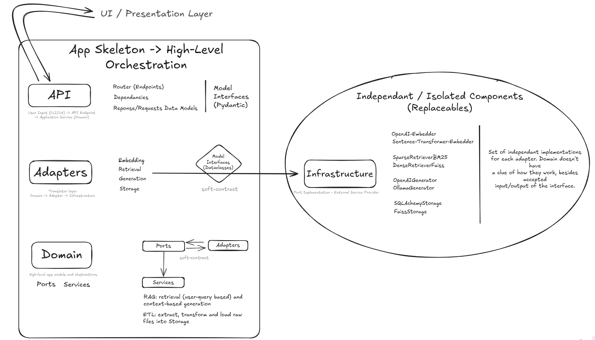
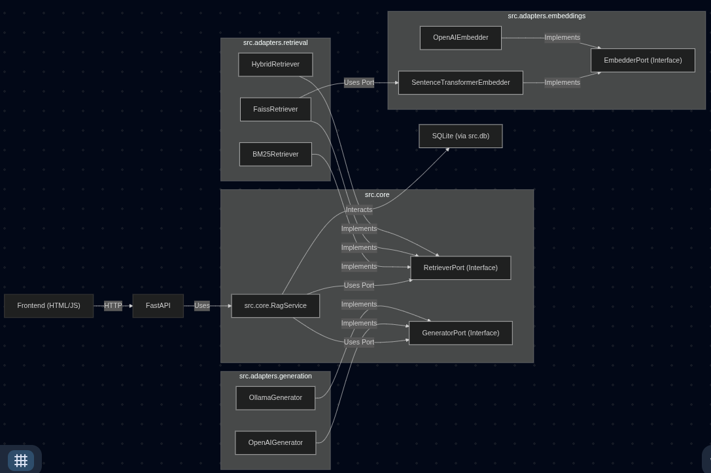
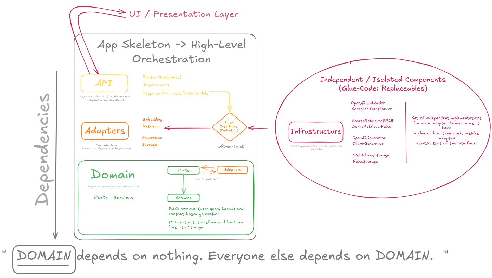

# 🧠 Intrinsical RAG Prototype

[](https://www.python.org/downloads/)
[](https://fastapi.tiangolo.com)
[](https://opensource.org/licenses/MIT)
[](https://github.com/psf/black)
[](https://github.com/astral-sh/ruff)
[](https://github.com/Intrinsical-AI/rag-prototype/actions)
[](https://github.com/Intrinsical-AI/rag-prototype)
[](https://hub.docker.com/r/intrinsical/rag-prototype)

> **Enterprise-grade RAG prototype** built with clean hexagonal architecture, featuring FastAPI backend, multiple retrieval strategies, LLM flexibility, and production-ready deployment. Perfect foundation for scalable AI applications.

## ✨ Key Features

### 🏗️ **Enterprise Architecture**
- **Hexagonal (Ports & Adapters)** - Clean separation enabling component swapping
- **Domain-Driven Design** - Business logic isolated from infrastructure concerns
- **Dependency Inversion** - Testable, maintainable, and extensible codebase

### 🔍 **Advanced Retrieval**
- **Sparse Retrieval** - BM25 algorithm for keyword-based search
- **Dense Retrieval** - FAISS vector search with sentence transformers
- **Hybrid Mode** - Combines both approaches with configurable weighting
- **Semantic Search** - Context-aware document matching

### 🤖 **LLM Integration**
- **Multi-Provider Support** - OpenAI GPT models and local Ollama
- **Configurable Models** - Easy switching between different LLMs
- **Async Processing** - Non-blocking API calls for better performance
- **Prompt Engineering** - Optimized templates for RAG responses

### 🚀 **Production Ready**
- **FastAPI Backend** - Modern async framework with auto-documentation
- **Docker Deployment** - Multi-stage builds with security best practices
- **Comprehensive Testing** - 85%+ coverage with unit, integration, and E2E tests
- **CI/CD Pipeline** - Automated testing, linting, and deployment
- **Monitoring Ready** - Health checks, logging, and metrics integration

### 📦 **Developer Experience**
- **PyPI Distribution** - `pip install intrinsical-rag-prototype`
- **CLI Tools** - Easy setup, management, and deployment commands
- **Hot Reload** - Development mode with automatic code reloading
- **Pre-commit Hooks** - Automated code quality checks



## 📋 Table of Contents

1. [🚀 Quick Start](#-quick-start)
2. [🏗️ Architecture](#️-architecture)
3. [⚙️ Configuration](#️-configuration)
4. [🛠️ Development](#️-development)
5. [🧪 Testing](#-testing)
6. [🐳 Deployment](#-deployment)
7. [📚 API Reference](#-api-reference)
8. [🎯 Design Decisions](#-design-decisions)
9. [⚠️ Limitations](#️-limitations)
10. [🤝 Contributing](#-contributing)

---

## Project Overview

#### Core Tenets & Design Philosophy

This project serves as a blueprint for building robust RAG systems, emphasizing:

Modularity & Testability: Achieved through a clean Hexagonal (Ports & Adapters) architecture, allowing components (LLMs, vector stores, databases) to be swapped with minimal impact.

Developer Experience: Streamlined setup, clear documentation, and a comprehensive suite of development tools (Docker, Makefile, pre-commit hooks, linters, formatters).

Production Readiness (Prototype Level): Demonstrates best practices in configuration, testing (>80% coverage), and containerization, forming a solid foundation for further development.

Flexibility: Supports fully offline operation (BM25 + SQLite) as well as integration with services like OpenAI.


#### Features
* **Hexagonal (Ports & Adapters) architecture** → Swap any component (LLM, vector DB, …) without touching business code.
* **Two retrieval modes**

  * **Sparse** BM25 (`rank‑bm25`) – default, 100 % offline.
  * **Dense** FAISS – optional, needs embeddings (run the build script once).
  * **Hybrid** – combine both.
* **Two LLM adapters**

  * **OpenAI** (`gpt‑3.5‑turbo` by default).
  * **Ollama** (local model like `gemma3:4b`).
* **SQLite + SQLAlchemy** for documents and Q\&A history.
* **FastAPI** backend + tiny **vanilla‑JS** frontend (single `index.html`).
* **Full test suite** (unit + integration).
* **Docker‑ready & CI template** (GitHub Actions).

---
---

## 1. Project Structure

```
.
├── data/          # csv, sqlite db, faiss files                   
├── frontend/      # single‑page UI (index.html + css/js)
├── src/           # application code (ports, adapters, api, scripts)
│   └── local_rag_backend/
│       ├── app/           # FastAPI app (main, routers, DI)
│       ├── scripts/       # helper scripts (build_index.py, bootstrap.py)
│       └── frontend/      # packaged index.html served by the app
├── tests/         # unit + integration + e2e tests
└── docs/          # diagrams & extra docs
```

---

## 2. Why This Design?

| Need (from task)        | Our Reasoning                                      | Implementation Choice                                    |
| :---------------------- | :------------------------------------------------- | :------------------------------------------------------- |
| *Rapid Prototyping*     | Zero external infra; minimal pure‑Python deps.     | SQLite + BM25 (default), FastAPI + Vanilla JS Frontend.  |
| *Scalable Path*         | Ability to swap components without major refactor. | Ports & Adapters (Hexagonal Architecture).               |
| *AI Integration*        | Must work offline **or** with OpenAI.              | `GeneratorPort` → `OpenAIGenerator` / `OllamaGenerator`. |
| *Data Handling*         | Basic knowledge base from CSV.                     | CSV ingested into SQLite; FAISS option for dense search. |
| *Efficient Reviewer UX* | Clone → install → ( build index ) → test → run.      | `build_index.py` script, `.env`‑based `settings.py`.     |
| *Minimal UI*            | Simple, functional, no heavy frameworks.           | Single `index.html` with vanilla HTML/CSS/JS.            |

---

## 3. Architecture at a Glance

The application follows a Ports & Adapters (Hexagonal) architecture to promote separation of concerns and testability.



**Dependency Rule:** Imports flow inwards toward the `src/core` components, following the Dependency Inversion Principle.



> For a deep dive, see [`docs/architecture.md`](docs/architecture.md).

---

## 🚀 Quick Start

### Installation

#### From PyPI (Recommended)

```bash
# Install the latest stable version
pip install intrinsical-rag-prototype

# Install with development dependencies
pip install "intrinsical-rag-prototype[dev]"

# Install with performance optimizations
pip install "intrinsical-rag-prototype[performance]"

# Install with monitoring capabilities
pip install "intrinsical-rag-prototype[monitoring]"

# Install with all optional dependencies
pip install "intrinsical-rag-prototype[all]"
```

#### From Source

```bash
# Clone the repository
git clone https://github.com/Intrinsical-AI/rag-prototype.git
cd rag-prototype

# Install in development mode
pip install -e ".[dev]"

# Or install in production mode
pip install .
```

#### Requirements

- **Python**: 3.11 or higher
- **Operating System**: Windows, macOS, or Linux
- **Memory**: Minimum 4GB RAM (8GB+ recommended for dense retrieval)
- **Storage**: ~500MB for dependencies, additional space for data/models

### Basic Usage

1. **Initialize the system:**
```bash
# Using CLI command (after pip install)
rag-bootstrap

# Or using Python module path
python -m local_rag_backend.scripts.bootstrap
```

2. **Start the server:**
```bash
# Using CLI command (recommended)
rag-server

# Or using uvicorn directly
uvicorn local_rag_backend.app.main:app --reload --host 0.0.0.0 --port 8000
```

3. **Access the application:**
   - **Web UI**: http://localhost:8000/
   - **API Documentation**: http://localhost:8000/docs
   - **OpenAPI Spec**: http://localhost:8000/openapi.json

### 🐳 Docker Deployment

```bash
# Quick start with Docker Compose
docker compose up --build

# With Ollama support for local LLM
docker compose --profile with-ollama up --build

# Development mode with hot reload
docker compose --profile dev up --build

# Production deployment
docker build -t intrinsical-rag .
docker run -p 8000:8000 \
  -e OPENAI_API_KEY=your_key \
  -e RETRIEVAL_MODE=hybrid \
  -v ./data:/app/data \
  intrinsical-rag
```

---

## 5. Configuration

Settings are centralized in `local_rag_backend/settings.py` (installed as part of the package) and can be overridden via environment variables or a `.env` file at the project root.

| Variable                 | Default                   | Required?            | Description                            |
| ------------------------ | ------------------------- | -------------------- | -------------------------------------- |
| `APP_HOST`               | `0.0.0.0`                 | No                   | Host IP for FastAPI server.            |
| `APP_PORT`               | `8000`                    | No                   | Port for FastAPI server.               |
| `RETRIEVAL_MODE`         | `sparse`                  | No                   | `sparse`, `dense` or `hybrid`.         |
| `SQLITE_URL`             | `sqlite:///./data/app.db` | No                   | SQLite connection URL.                 |
| `FAQ_CSV`                | `data/faq.csv`            | No                   | Path to FAQ CSV file.                  |
| `CSV_HAS_HEADER`         | `True`                    | No                   | CSV contains header row.               |
| `INDEX_PATH`             | `data/index.faiss`        | Only for dense mode  | Path to FAISS index file.              |
| `ID_MAP_PATH`            | `data/id_map.pkl`         | Only for dense mode  | Path to FAISS ID map.                  |
| `OPENAI_API_KEY`         | —                         | Yes, if using OpenAI | API key for OpenAI completions.        |
| `OPENAI_MODEL`           | `gpt-3.5-turbo`           | No                   | Chat model for OpenAI generator.       |
| `OPENAI_EMBEDDING_MODEL` | `text-embedding-3-small`  | No                   | Embedding model for dense retrieval.   |
| `OPENAI_TEMPERATURE`     | `0.2`                     | No                   | Sampling temperature for OpenAI calls. |
| `OLLAMA_ENABLED`         | `True`                    | No                   | Enable/disable local Ollama generator. |
| `OLLAMA_MODEL`           | `gemma3:4b`               | Only if enabled      | Model name served by Ollama.           |
| `OLLAMA_BASE_URL`        | `http://localhost:11434`  | Only if enabled      | Base URL of Ollama server.             |
| `OLLAMA_REQUEST_TIMEOUT` | `90`                      | No                   | Timeout (s) for Ollama HTTP requests.  |

---

## 🛠️ Development

### Prerequisites

- **Python 3.11+** (3.12+ recommended)
- **Git** for version control
- **Docker** (optional, for containerized development)
- **Make** (optional, for convenience commands)

### Development Commands

| Task | Command | Description |
|------|---------|-------------|
| **Install dev dependencies** | `pip install -e ".[dev]"` | Install with all development tools |
| **Run server (dev)** | `rag-server` or `uvicorn local_rag_backend.app.main:app --reload` | Start development server |
| **Build index** | `rag-build-index` or `python -m local_rag_backend.scripts.build_index` | Create/rebuild search index |
| **Bootstrap data** | `rag-bootstrap` or `python -m local_rag_backend.scripts.bootstrap` | Initialize database and data |
| **Run tests** | `pytest` | Run full test suite |
| **Test with coverage** | `pytest --cov=src --cov-report=html` | Generate coverage report |
| **Lint code** | `ruff check .` | Check code quality |
| **Format code** | `black . && isort .` | Auto-format code |
| **Type check** | `mypy src/` | Static type checking |
| **Pre-commit hooks** | `pre-commit run --all-files` | Run all quality checks |

### Development Setup

```bash
# Clone and setup development environment
git clone https://github.com/Intrinsical-AI/rag-prototype.git
cd rag-prototype

# Create virtual environment
python -m venv .venv
source .venv/bin/activate  # Windows: .venv\Scripts\activate

# Install in development mode
pip install -e ".[dev]"

# Setup pre-commit hooks
pre-commit install

# Initialize the system
rag-bootstrap
```

---

## 🧪 Testing

### Running Tests

```bash
# Run all tests
pytest

# Run with coverage report
pytest --cov=src --cov-report=html

# Run specific test categories
pytest -m unit              # Unit tests only
pytest -m integration       # Integration tests only
pytest -m "not slow"        # Skip slow tests

# Parallel testing for faster execution
pytest -n auto              # Auto-detect CPU cores

# Generate detailed coverage report
pytest --cov=src --cov-report=html --cov-report=term-missing
```

### Test Categories

- **Unit Tests** - Fast, isolated component testing
- **Integration Tests** - Database and service integration
- **E2E Tests** - Full application workflow testing
- **Performance Tests** - Load and stress testing (marked as `slow`)

### Coverage Requirements

- **Minimum Coverage**: 85%
- **Branch Coverage**: Enabled
- **Missing Lines**: Reported in terminal and HTML

---

## 📚 API Reference

### Core Endpoints

| Method | Path           | Body (JSON)                       | Response (JSON)                                  | Description                               |
| :----: | :------------- | :-------------------------------- | :----------------------------------------------- | :---------------------------------------- |
|  `GET` | `/`            | N/A                               | HTML                                             | Serves the frontend UI.                   |
| `POST` | `/api/ask`     | `{ "question": "str", "k": int }` | `{ "answer": "str", "sources": [ {document, score}, ... ] }` | Returns AI-generated answer & source docs. |
|  `GET` | `/api/history` | Query: `limit`, `offset`          | `[ { "id": int, "question": "str", ... }, ... ]` | Retrieves past Q&A records.               |

*Note:* The frontend HTML is bundled within the package and served automatically at `/`. In development, if you modify `frontend/index.html` at the repo root, the server will fall back to that file.

*See interactive API docs at `/docs` for full details and schemas.*


---

## 🎯 Design Decisions & Trade-Offs

| Aspect             | Chosen Approach                                                     | Alternatives Considered       | Rationale                                            |
| :----------------- | :------------------------------------------------------------------ | :---------------------------- | :--------------------------------------------------- |
| **Backend**        | Python, FastAPI                                                     | Flask, Django                 | Async support, Pydantic validation, auto docs.       |
| **Frontend**       | Vanilla HTML/CSS/JS                                                 | React, Vue, Jinja2 templates  | Minimal dependencies; rapid prototyping.             |
| **Architecture**   | Ports & Adapters (Hexagonal)                                        | Monolithic, Layered           | Decoupling, testability, swappable components.       |
| **Data Store**     | SQLite                                                              | In-memory list, CSV, Postgres | Simple persistent storage with ORM; zero infra.      |
| **Data Ingestion** | CSV ingested via `build_index.py`                                   | Direct DB input, API upload   | Script allows preprocessing and index building.      |
| **Retrieval**      | BM25 (sparse), FAISS (dense)                                        | TF-IDF, other vector DBs      | BM25 for quick start; FAISS for embedding lookup.    |
| **LLM Interface**  | Abstract `GeneratorPort` with `OpenAIGenerator` & `OllamaGenerator` | Direct SDK calls              | Enables easy switching between local and cloud LLMs. |
| **Testing**        | Pytest, `TestClient`, `unittest.mock`                               | `unittest`                    | Clean syntax, fixtures, built‑in coverage plugins.   |

* **FAISS Index Type:** IndexFlatL2 for fast setup; consider IVF or HNSW for larger corpora (>500k docs).

---

## ⚠️ Limitations & Considerations

### Current Limitations

* **Run `scripts/bootstrap.py` first** (DataRepos init + configured csv ETL).
* Minimal UI without automated frontend tests (manual only).
* No authentication or rate-limiting—unsuitable for open production.
* BM25 and IndexFlatL2 are prototyping choices; scale with Elasticsearch, IVF, HNSW as needed. That's why hex-arch makes sense here!
* Basic error handling; production demands finer-grained monitoring and retries.
* Timezone handling: `created_at` fields are ISO 8601 strings; UI may need conversion per locale.

---

## 🤝 Contributing

### Development Workflow

1. **Fork** the repository
2. **Create** a feature branch: `git checkout -b feature/amazing-feature`
3. **Install** pre-commit hooks: `pre-commit install`
4. **Make** your changes with tests
5. **Run** the test suite: `pytest`
6. **Submit** a pull request

### Code Standards

- **Type Hints**: Required for all public APIs
- **Documentation**: Docstrings for all modules, classes, and functions
- **Testing**: Minimum 85% coverage for new code
- **Formatting**: Black + isort + Ruff (enforced by pre-commit)

### Issue Reporting

- Use GitHub Issues for bug reports and feature requests
- Include reproduction steps and environment details
- Check existing issues before creating new ones

---

## 📖 Additional Resources

- **Architecture Deep Dive**: [`docs/architecture.md`](docs/architecture.md)
- **API Documentation**: Available at `/docs` when running the server
- **Performance Tuning**: See FAISS documentation for optimization tips
- **Deployment Guide**: [`docs/deployment.md`](docs/deployment.md)

---

## 📄 License

**MIT License** - see [LICENSE](LICENSE) file for details.

---

<div align="center">

**Built with ❤️ by [Intrinsical AI](https://intrinsical.ai)**

[🌟 Star us on GitHub](https://github.com/Intrinsical-AI/rag-prototype) • [📝 Report Issues](https://github.com/Intrinsical-AI/rag-prototype/issues) • [💬 Discussions](https://github.com/Intrinsical-AI/rag-prototype/discussions)

</div>
