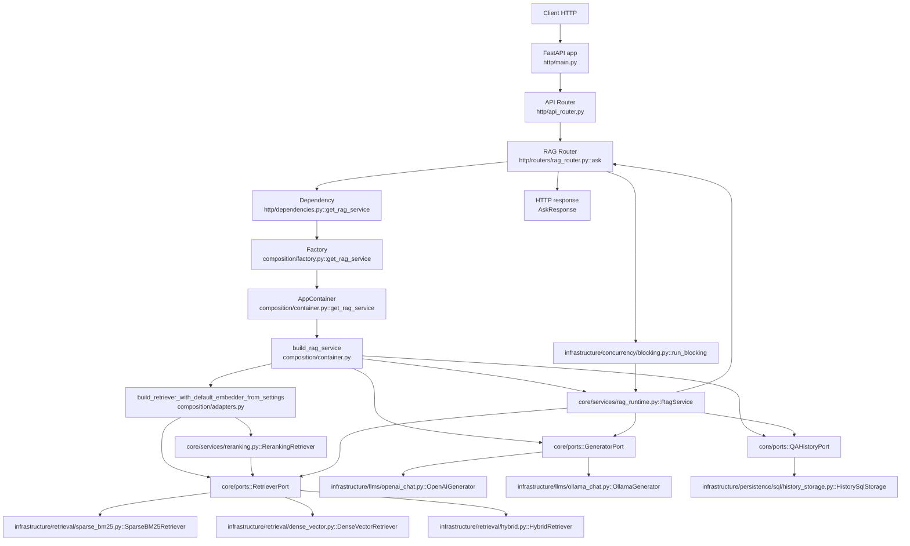
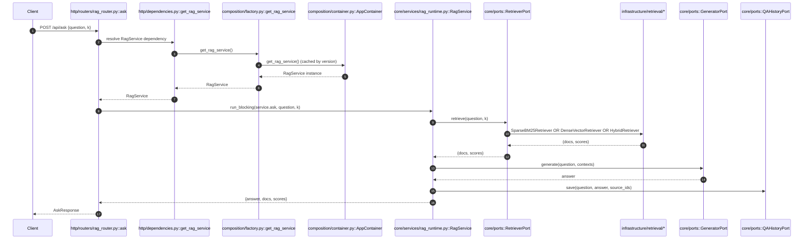

# Stateful RAG Platform: A Port & Adapters Modular Approach

[](https://www.python.org/downloads/)
[](https://fastapi.tiangolo.com)
[](https://opensource.org/licenses/MIT)
[](https://github.com/astral-sh/ruff)
[](https://github.com/Intrinsical-AI/rag-prototype/actions)
[](https://github.com/Intrinsical-AI/rag-prototype)
[](https://hub.docker.com/r/intrinsical/rag-prototype)
<!-- [](https://pypi.org/project/rag-prototype/)
[](https://pypi.org/project/rag-prototype/) -->

> Stateful RAG platform with a hexagonal architecture (Ports & Adapters), FastAPI, canonical mutation flows, and offline evaluation gates. It supports four retrieval modes (BM25, dense vector, dual, hybrid) plus swappable LLM connectors (OpenAI, OpenRouter, Ollama).
> Default runtime mode is `sparse` on `local_split` persistence (`SQLite` only). Dense/dual/hybrid can run either on `local_split` (`SQLite + faiss/numpy`) or on a unified Elasticsearch backend. The write-path is intentionally stateful: canonical mutations, rebuilds, and recovery are first-class.

---

## Key Features

* **Clean architecture**

  * Hexagonal (Ports & Adapters): domain decoupled from infrastructure.
  * Explicit typing and domain models.
* **Retrieval**

  * Sparse: BM25 (offline).
  * Dual: sparse candidate pool with dense rerank.
  * Dense: local vector index (`faiss`/`numpy`) or unified Elasticsearch vector search.
  * Hybrid: local dense+BM25 combination or Elasticsearch lexical+vector fusion.
* **LLMs**

  * OpenAI Chat (via API key).
  * OpenRouter support (as OpenAI-compatible provider and dedicated proxy endpoint).
  * Local Ollama (over HTTP). Current clients are synchronous.
* **Persistence**

  * `local_split`: SQLite via SQLAlchemy for documents/history + on-disk vector index for dense/hybrid.
  * `elasticsearch`: unified documents, vectors, history, system state, and tombstones in Elasticsearch.
* **API**

  * FastAPI with validation and OpenAPI at `/docs`.
  * Public probes: `/healthz`, `/readyz`, Ollama health: `/healthz/ollama`.
  * Config: `/api/config`, Templates: `/api/templates`.
  * OpenRouter proxy (OpenAI-compatible): `POST /api/openrouter/generate`.
* **Tests**

  * Unit, integration, and E2E with `pytest`.

---

## Quick start

```bash
git clone https://github.com/Intrinsical-AI/rag-prototype.git
cd rag-prototype

# Recommended: uv-managed local venv + lockfile installs
# Keep uv cache local to the repo for sandboxed/devcontainer setups.
export UV_CACHE_DIR=.uv_cache
uv venv .venv
source .venv/bin/activate
# Windows: .venv\Scripts\activate

# Install runtime deps (uses uv.lock); --extra server adds FastAPI/uvicorn
uv sync --frozen --extra server

# config.yaml is required by default. Fresh source clones include the default file;
# this protects archive/copy workflows where only config.example.yaml is present.
test -f config.yaml || cp config.example.yaml config.yaml

# Installed commands can run from another directory by selecting the same YAML explicitly.
# export RAG_CONFIG_PATH=/absolute/path/to/config.yaml

# Before using /api/ask or expecting /readyz to pass, enable one LLM provider in config.yaml:
# - openai_api_key: "..."
# - openrouter_enabled: true + openrouter_api_key: "..."
# - ollama_enabled: true, with Ollama running locally

# (Optional) Dense/Hybrid deps for local split backend (FAISS)
# uv sync --frozen --extra server --extra dense
#
# (Optional) SentenceTransformers embeddings (heavy: torch/transformers)
# uv sync --frozen --extra dense-st

# (Optional) Dev/Test/Lint groups
# uv sync --frozen --group dev --group test --group lint --no-default-groups
```

Initialize sample data and start:

```bash
# Load sample CSV into the configured backend and, if applicable, build/rebuild retrieval state
rag-bootstrap


# FastAPI server
rag-server
# UI: http://localhost:8000/
# Health: http://localhost:8000/healthz
# Readiness: http://localhost:8000/readyz
# Ollama health: http://localhost:8000/healthz/ollama
# Docs: http://localhost:8000/docs
```

> `/healthz` confirms the HTTP app is alive. `/readyz` and `/api/ask` require a configured
> LLM provider and may return `503` until `config.yaml` enables OpenAI, OpenRouter, or Ollama.

> `rag-server` does not accept CLI flags (`--host`, `--port`, etc.). Host and port are controlled
> exclusively via `config.yaml` (`app_host`, `app_port`).

> Alternative startup (without `rag-server` wrapper):
> `uvicorn local_rag_backend.http.main:app --reload`.

---


## Configuration

Runtime configuration defaults to `config.yaml` in the process working directory.
When `debug: false`, `cors_allow_origins` accepts only explicit origins such as
`https://app.example.com`; a wildcard (`"*"`) is rejected at startup. Leave the
list empty to disable cross-origin access. Debug mode keeps the permissive
wildcard policy for local development.
Set `RAG_CONFIG_PATH=/absolute/path/to/runtime.yaml` when an installed console script, including
`rag-mcp`, runs outside the checkout. The selected YAML remains the single runtime source of truth,
and relative paths inside it resolve against that file's directory. An explicit path passed to
`load_settings_from_yaml(...)` takes precedence over the environment variable. The process fails
fast if the selected file is missing or invalid.
See [`config.example.yaml`](./config.example.yaml) for the canonical template.

`RAG_PERF_METRICS_OUT` remains a narrow runtime override for `perf_metrics_out_path`; when both
environment variables are set, its relative value is resolved against the selected YAML directory.

All runtime keys are shown in `snake_case` and map 1:1 to the fields in `config.yaml`.


### Backend matrix

| `persistence_backend` | `search_backend` | `retrieval_mode` | Canonical write model | Notes |
| --- | --- | --- | --- | --- |
| `local_split` | `local_split` (default) | `sparse`, `dense`, `dual`, `hybrid` | `DURABLE_SAGA` | Default standalone topology. Sparse/dual are SQLite-backed; dense/hybrid add local vector state. |
| `local_split` | `elasticsearch` | `sparse`, `dense`, `dual` | `DURABLE_SAGA` | Remote Elasticsearch query execution over local SQL persistence. `hybrid` is rejected. |
| `local_split` | `opensearch` | `sparse`, `dense`, `dual` | `DURABLE_SAGA` | Remote OpenSearch query execution over local SQL persistence. `hybrid` is rejected. |
| `local_split` | `solr` | `sparse` | `DURABLE_SAGA` | Lexical-only backend. Dense/dual/hybrid are rejected. |
| `elasticsearch` | `elasticsearch` | `sparse`, `dense`, `dual`, `hybrid` | `ATOMIC` | Unified docs/history/vectors/system-state/tombstones in Elasticsearch. |
| `elasticsearch` | `local_split` | `dense`, `dual`, `hybrid` | `ATOMIC` | ES-backed persistence with local_split query orchestration. Sparse is rejected. |
| `elasticsearch` | `opensearch` | `dense`, `dual` | `ATOMIC` | ES-backed persistence with OpenSearch query execution. Sparse/hybrid are rejected. |
| `elasticsearch` | `solr` | none | `ATOMIC` | Rejected at startup. Solr is sparse-only, but sparse is disallowed with ES persistence unless `search_backend=elasticsearch`. |

The selector in `Settings` plus `composition/adapters.py` enforce this matrix at startup.

### Index manifest (`local_split` dense/hybrid only)

When `persistence_backend=local_split` and `retrieval_mode=dense|hybrid`, the system writes an `index_manifest.json` next to `index_path`.
It records stable identifiers for the index build (embedding backend/model, dimension, chunker strategy/version).

If you change any of these settings, `/readyz` and `rag-status` will report drift and instruct you to rebuild:
`rag-rebuild-index` (or `POST /api/index/rebuild`).

**Note:**  **fresh-install only** storage contract.
* canonical document IDs are opaque strings (`doc:<uuid7>`)
* SQL documents use `doc_id` as the primary key
* vector `id_map.json` stores `list[str]`
* no runtime migration/fallback for older schemas or id maps

### Retrieval Adapter Resolution

The backend matrix above is authoritative. The common runtime routes are:

* `local_split` + `local_split`:
  `SparseBM25Retriever`, `DenseVectorRetriever`, or `HybridRetriever(DenseVectorRetriever, SparseBM25Retriever, alpha)`.
* `local_split` + `elasticsearch` or `opensearch`:
  `ElasticLikeSearchRetriever` for `sparse`, `dense`, or `dual`.
* `local_split` + `solr`:
  `SolrSearchRetriever` for `sparse` only.
* `elasticsearch` + `elasticsearch`:
  `ElasticLikeSearchRetriever` for `sparse`/`dense`, and `HybridRetriever(DenseVectorRetriever, Elastic lexical retriever, alpha)` for `hybrid`.
* `elasticsearch` + `local_split`:
  `LocalSplitSearchRetriever`-style orchestration over ES-backed persistence for `dense`/`dual`/`hybrid`.
* `elasticsearch` + `opensearch`:
  `ElasticLikeSearchRetriever` for `dense`/`dual`.
* If `enable_reranker: true`, the selected retriever is wrapped as:
  `RerankingRetriever(base=<selected>)`

This boundary is enforced in `composition/adapters.py` and consumed by `AppContainer`.


---

## Advanced usage

The detailed ingestion, canonical mutation, and evaluation flows are documented in
[`docs/USAGE.md`](./docs/USAGE.md).

Use these entrypoints for the main workflows:

* `rag-ingest` for file/directory ingestion.
* `rag-mutate-docs` for canonical writes via `MutationCoordinator`.
* `rag-import-canonical` for scope/snapshot import and sync.
* `rag-rebuild-index` for explicit repair of dense/dual/hybrid state.
* `rag-eval`, `rag-eval-batch`, and `rag-eval-compare` for offline evaluation gates.

See the evaluation section in [`docs/USAGE.md`](./docs/USAGE.md#operabilidad-metricas-evaluacion-y-reranker)
for batch-spec examples and compare-mode usage.

`rag-import-canonical` is the canonical integration path for external producers such as RepoGPT `code-units` v4. The import flow stays generic, but the edge transport now validates RepoGPT `kind="code-units"` and `schema_version="4"` when those producer markers are present.

Offline evaluation uses dataset-scoped workspaces under `<data_dir>/_eval_workspaces/`.
That runtime stays isolated from the main index, but it is no longer purely ephemeral:

* dense eval workspaces reuse the persisted local index when the dataset signature and vector manifest still match
* changing the dense backend, embedding model, or other vector manifest inputs invalidates the cached eval workspace and rebuilds it
* dense rebuilds happen in bounded batches to reduce memory spikes on larger evaluation corpora
* `RAG_PERF_METRICS_OUT=/abs/path.json` can override `perf_metrics_out_path` for benchmark wrappers without editing `config.yaml`

Optional: better file type detection (best-effort) using `python-magic`:

```bash
uv sync --frozen --extra magic
# or: pip install rag-prototype[magic]
```

`rag-ingest` detection is Unicode-aware (UTF-8 text with non-ASCII characters is accepted) and
handles unreadable files as best-effort skips instead of aborting the full ingestion run.

Optional: Prometheus metrics (`/metrics`) and structured-ish domain metrics:

```bash
uv sync --frozen --extra monitoring
# then set `enable_monitoring: true` in config.yaml
rag-server
```

Optional: performance extras (`torch` + `orjson` for faster JSON serialization):

```bash
uv sync --frozen --extra performance      # torch + orjson (CPU)
uv sync --frozen --extra performance-cpu  # alias, identical to performance
```

These extras are included in `all` but are **not required** for sparse or dense retrieval. Install only when you have profiled a serialization or inference bottleneck that justifies the `torch` dependency weight.

Optional: reranker (retrieval quality knob, measurable via `rag-eval`):

```bash
# set these in config.yaml:
# enable_reranker: true
# reranker_candidate_k: 20
```

Optional: MCP server for agent-facing operational workflows:

```bash
rag-mcp
# or: python -m local_rag_backend.mcp_server
```

Tools:

* `rag_ask`
* `rag_import_canonical`
* `rag_rebuild_index`
* `rag_eval`
* `rag_status`

`rag_ask` is the narrow query/status integration surface used by the sibling
`event-based-agent-runtime` repo. The runtime calls it over stdio MCP and keeps
document mutation, index rebuild, and evaluation workflows owned by this repo.

`rag_status` now returns a structured runtime snapshot plus health/index diagnostics, so agents
do not need to infer topology from raw config fields.


### Run with Docker Compose (including Ollama)

```bash
# Build and start backend + Ollama
docker compose up -d --build

# (Optional) Pull a model into Ollama once the service is up
docker exec -it ollama ollama pull lfm2.5-thinking

# Verify services
curl http://localhost:8000/healthz
curl http://localhost:8000/healthz/ollama
```

Notes:
- Backend listens on `8000`, Ollama on `11434`.
- Configure providers via `config.yaml`.
- `docker-compose.yml` sets container environment defaults for convenience, but the app still reads `config.yaml` as the runtime source of truth. If you want compose-driven config, mount or generate a `config.yaml` inside the container.
- `docker-compose.yml` defaults the container runtime to `persistence_backend: local_split` and `retrieval_mode: sparse`, but those values do not override `config.yaml` by themselves.
- For `local_split` dense/hybrid in compose, build backend with extras, for example:

```bash
docker compose build --build-arg RAG_EXTRAS=dense rag-backend
# add dense-st too if you need SentenceTransformers:
# docker compose build --build-arg RAG_EXTRAS=dense,dense-st rag-backend
docker compose up -d
```

> Docker build expectations (CI parity). Recommended local verification: `docker build --target production .`


---

## Project structure

```bash
.
├── data/                      # CSV, SQLite DB, vector index files
├── src/local_rag_backend/
│   ├── core/                  # domain, ports, services, use cases
│   │   ├── domain/            # entities, types, storage profiles
│   │   ├── ports/             # abstract contracts (Protocol-based)
│   │   ├── services/          # domain services (ETL, RAG runtime, reranking)
│   │   └── use_cases/         # application use cases (ingest, query, mutation, …)
│   ├── infrastructure/        # adapters: llms, retrievers, storage, loaders, observability
│   ├── composition/           # DI container, factory, wiring (transport-neutral)
│   ├── integrations/          # stable installed-consumer APIs (PEP 561 typed)
│   ├── http/                  # FastAPI transport adapter (routers, schemas, middleware)
│   ├── cli_commands/          # CLI transport adapters (ingest, mutate, eval, …)
│   ├── scripts/               # internal scripts (sample data ingestion)
│   └── frontend/              # packaged index.html to serve at /
└── tests/                     # unit + integration + e2e
```

### Extension and integration points

* **Installed embeddings consumer**: use the typed [`local_rag_backend.integrations.embeddings`](docs/embedding_integration.md) API; do not import CLI or composition helpers.
* **LLM**: implement `GeneratorPort` (see `infrastructure/llms/*`) and wire it in `composition/factory.py`.
* **Retriever**: implement `RetrieverPort` and wire it through `composition/adapters.py` (`build_retriever_from_settings` / `build_retriever_with_default_embedder_from_settings`).
* **Vector store**: implement `VectorRepoPort` (e.g., an alternative to FAISS).
* **Document store**: implement `DocumentRepoPort` to use a DB other than SQLite.
* **Loader**: implement `LoaderPort` for new sources (PDFs, web, etc.).


## API

* `GET /` → Serves packaged `index.html` or the source tree `src/local_rag_backend/frontend/index.html`.
* `GET /healthz` and `GET /readyz`
* `GET /healthz/ollama`
* `GET /api/config` and `GET /api/templates`
* `POST /api/ask`
  * Body: `{ "question": "str", "k": int (1..10, default 3), "filters": [{"field":"scope|snapshot_id|source_id|metadata.<key>","values":["..."]}] }`
  * Response: `{ "answer": "str", "sources": [ { "document": {"id": "doc:...", "content": "str", "external_id": "str|null", "source_id": "str|null", "metadata": {...}|null}, "score": float(0..1) }, ... ] }`
* `POST /api/ask_eval` (ephemeral per-request RAG config for retrieval/generator evaluation)
* `GET /api/history?limit=1..100&offset>=0`

* Response: list of `{ id, question, answer, created_at, source_ids[] }` where `source_ids` are string document IDs
* FastAPI docs: `GET /docs` and `GET /openapi.json`
* `POST /api/docs` (ingest texts)
* `POST /api/docs/query` (list/query documents with structured filters)
* `POST /api/docs/import` (ingest conversations from ChatGPT/Gemini export JSON)
* `POST /api/docs/mutate` (canonical unified docs mutation: upserts, delete_ids, delete_external_ids)
* `POST /api/docs/import-canonical` (scope/snapshot import for external producers such as RepoGPT)
* `POST /api/index/rebuild` (idempotent rebuild of retrieval state from the canonical document store; dense/dual/hybrid only)
* `POST /api/openrouter/generate` (enabled only when `openrouter_enabled=true` and `openrouter_api_key`
  are both set)

Notes:

* Retrieval “scores” are normalized to [0,1] in the adapters.
* The service persists each Q/A with the IDs of the retrieved sources (best-effort; retrieval/answer response is not blocked if history persistence fails).
* For `/api/ask`, default provider selection is `ollama` -> `openai` -> `openrouter` depending on active
  configuration. OpenRouter is only considered available when `openrouter_enabled=true` and
  `openrouter_api_key` is set.
* In dense/dual/hybrid mode, write via `/api/docs/mutate`, `/api/docs/import-canonical`, `rag-mutate-docs`, or `rag-import-canonical` rather than mutating stores independently.
* `local_split` uses `MutationCoordinator` with `DURABLE_SAGA`: SQL commit + vector delta (`apply_delta_atomic`) + journaled compensation/recovery.
* `elasticsearch` uses `MutationCoordinator` with an atomic backend path: document, vector, history, system-state, and tombstone semantics are unified in Elasticsearch.
* Full rebuild is an explicit repair operation only (`/api/index/rebuild` or `rag-rebuild-index`), not a normal write fallback.
* `/readyz` is stricter than `/healthz`: it returns `503` when no LLM provider is configured, even if the HTTP app and database are otherwise healthy.
* In `local_split` dense/dual/hybrid mode, `/readyz` is intentionally strict and returns `503` when it detects missing/corrupt index files or drift between SQLite documents and the vector index.
* In `elasticsearch` mode, `/readyz` validates backend connectivity, index existence, mapping dimensions, and embedded-document counts.
* For public/proxy deployments, set `api_key` in `config.yaml` and sanitize `X-Forwarded-For` / `Forwarded` at the edge proxy.

Example:

```bash
curl -X POST "http://localhost:8000/api/ask" \
  -H "Content-Type: application/json" \
  -d '{"question": "What is RAG?", "k": 3, "filters":[{"field":"metadata.unit_type","values":["function"]}]}'
```

---

## Strict Request-Flow Architecture (`/api/ask`)

The following diagram maps the real runtime path of a request from
`src/local_rag_backend/http/routers/rag_router.py` to `core/ports` and into
`infrastructure/retrieval`.


```mermaid
flowchart TD
    C[Client HTTP] --> M[FastAPI app\nhttp/main.py]
    M --> AR[API Router\nhttp/api_router.py]
    AR --> RR[RAG Router\nhttp/routers/rag_router.py::ask]

    RR --> D1[Dependency\nhttp/dependencies.py::get_rag_service]
    D1 --> F1[Factory\ncomposition/factory.py::get_rag_service]
    F1 --> AC[AppContainer\ncomposition/container.py::get_rag_service]
    AC --> BRS[build_rag_service\ncomposition/container.py]

    BRS --> RS[core/services/rag_runtime.py::RagService]

    BRS --> COMP[build_retriever_with_default_embedder_from_settings\ncomposition/adapters.py]
    COMP --> RP[core/ports::RetrieverPort]
    RP --> SBR[infrastructure/retrieval/sparse_bm25.py::SparseBM25Retriever]
    RP --> DFR[infrastructure/retrieval/dense_vector.py::DenseVectorRetriever]
    RP --> HR[infrastructure/retrieval/hybrid.py::HybridRetriever]
    COMP --> RER[core/services/reranking.py::RerankingRetriever]
    RER --> RP

    BRS --> GP[core/ports::GeneratorPort]
    GP --> OAI[infrastructure/llms/openai_chat.py::OpenAIGenerator]
    GP --> OLL[infrastructure/llms/ollama_chat.py::OllamaGenerator]

    BRS --> HP[core/ports::QAHistoryPort]
    HP --> HSQL[infrastructure/persistence/sql/history_storage.py::HistorySqlStorage]

    RR --> RB[infrastructure/concurrency/blocking.py::run_blocking]
    RB --> RS
    RS --> RP
    RS --> GP
    RS --> HP
    RS --> RR
    RR --> RESP[HTTP response\nAskResponse]
```

### Strict sequence (runtime)


```mermaid
sequenceDiagram
    autonumber
    participant Client
    participant Router as http/routers/rag_router.py::ask
    participant Dep as http/dependencies.py::get_rag_service
    participant Factory as composition/factory.py::get_rag_service
    participant Container as composition/container.py::AppContainer
    participant RagService as core/services/rag_runtime.py::RagService
    participant Retriever as core/ports::RetrieverPort
    participant InfraRet as infrastructure/retrieval/*
    participant Gen as core/ports::GeneratorPort
    participant Hist as core/ports::QAHistoryPort

    Client->>Router: POST /api/ask {question, k}
    Router->>Dep: resolve RagService dependency
    Dep->>Factory: get_rag_service()
    Factory->>Container: get_rag_service() (cached by version)
    Container-->>Factory: RagService instance
    Factory-->>Dep: RagService
    Dep-->>Router: RagService

    Router->>RagService: run_blocking(service.ask, question, k)
    RagService->>Retriever: retrieve(question, k)
    Retriever->>InfraRet: SparseBM25Retriever OR DenseVectorRetriever OR HybridRetriever
    InfraRet-->>Retriever: (docs, scores)
    Retriever-->>RagService: (docs, scores)

    RagService->>Gen: generate(question, contexts)
    Gen-->>RagService: answer
    RagService->>Hist: save(question, answer, source_ids)
    RagService-->>Router: {answer, docs, scores}
    Router-->>Client: AskResponse
```


---

### Type boundaries

* `http/schemas/*`: HTTP request/response contracts (Pydantic transport layer).
* `core/use_cases/results.py`: use-case outputs shared by API/CLI.
* `core/services/types.py`: transport-agnostic core DTOs (chunking/eval/detection).
* `core/domain/entities.py`: domain entities and business invariants.
* `infrastructure/persistence/*/models.py`: ORM persistence models.

---


## Current limitations

* Synchronous LLM clients (httpx/OpenAI SDK); migration to async is straightforward but not included.
* Minimal UI without front-end tests.
* Minimal API-key auth is available via `api_key` in `config.yaml`, but there is no user/role authZ or rate limiting.
* When using the FAISS backend, the index type is `IndexFlatL2` (simple). For large volumes, consider IVF/HNSW or other backends.

## Runtime considerations

* **Singleton per process**: `RagService` is initialized as a singleton in `composition/factory`. With `uvicorn --workers N`, each process loads its own instance (and its retrieval/index adapters). Align deployment and warm-up as needed.
* **Cross-process coordination files**: multi-store write lock and RAG reload token are stored in a shared coordination directory (`Settings.get_coordination_dir()`), preferring explicit absolute `data_dir`; when `data_dir` is relative/default and `sqlite_url` resolves to an absolute SQLite path, it uses the DB parent directory to keep workers/CLI aligned.
* **Metrics**: if `enable_monitoring: true` and `prometheus-client` is installed, `/metrics` provides Prometheus format.
* **Dense/Hybrid**: must use the same embedding model for indexing and querying (`st_embedding_model`).

## Tests

```bash
UV_CACHE_DIR=.uv_cache uv sync --frozen --group test --group lint --extra server --no-default-groups
UV_CACHE_DIR=.uv_cache uv run --active --no-sync pytest -q
UV_CACHE_DIR=.uv_cache uv run --active --no-sync ruff check src tests
PYTHONPATH=src UV_CACHE_DIR=.uv_cache uv run --active --no-sync lint-imports
uv run pre-commit run --all-files
```

> Test suite includes unit, integration, and E2E (FastAPI TestClient). The vector layer defaults to `vector_backend: auto` (FAISS when available, NumPy fallback otherwise), and many tests use stubs/mocks for external providers. The suite enforces `--cov-fail-under=85` via `pyproject.toml`.

### CI gates

Current CI gates include:

- `pre-commit run --all-files`
- `ruff check src tests` and `ruff format --check src tests`
- `mypy src`
- architecture guardrails: `pytest -q -o addopts='' tests/architecture/test_*.py`
- `lint-imports` (macro architecture contracts via `.importlinter`)
- tests on Python `3.11` and `3.12` (Ubuntu) plus Windows smoke tests
- security scan job (`bandit` + `safety` report generation)
- Docker build for `--target production` on `main/master`

Workflow trigger note:
- PRs/commits that only change docs (`**/*.md`, `docs/**`) do not trigger CI due to `paths-ignore` in `.github/workflows/ci.yml`.
- Run local validation manually for doc-only changes when they alter architecture/API/operations guidance.

For local parity, use:

```bash
make lint
make lint-imports
make type
make test
make sec        # strict
make sec-soft   # non-blocking local audit
```

## See also: LangChainLoader
You can ingest data from any LangChain document loader via the `LangChainLoader` adapter, which implements the project's `LoaderPort`.

Installation:

```bash
uv sync --frozen --extra loaders
# or when installing from PyPI:
# pip install rag-prototype[loaders]
```

Quick usage example:

```python
from langchain_community.document_loaders import WebBaseLoader
from local_rag_backend.composition.container import AppContainer
from local_rag_backend.core.use_cases.docs_mutation import (
    MutationCoordinator,
    MutationIntent,
    MutationUpsertInput,
)
from local_rag_backend.infrastructure.ingestion.loaders import LangChainLoader
from local_rag_backend.settings import settings

# 1) Wrap any LangChain loader
lc_loader = WebBaseLoader(["https://example.com"])  # or DirectoryLoader, SitemapLoader, etc.
loader = LangChainLoader(lc_loader, drop_empty=True, metadata_filter={"lang": "en"})

# 2) Convert LoaderPort items into a canonical mutation intent
upserts = []
for i, item in enumerate(loader.load()):
    locator = item.lineage.record_locator or f"item:{i}"
    upserts.append(
        MutationUpsertInput(
            external_id=f"{item.lineage.source_uri}#{locator}",
            content=item.text,
            source_id=item.lineage.source_uri,
            metadata=item.metadata,
        )
    )

# 3) Persist through the canonical write path
container = AppContainer.from_settings(settings)
coordinator = MutationCoordinator(settings_obj=settings, ports=container.docs_mutation_ports())
summary = coordinator.execute(
    MutationIntent(op_id="", upserts=tuple(upserts), source="langchain:web")
)
print(summary)
```

Notes:

- `drop_empty=True` skips whitespace-only documents.
- `metadata_filter={...}` yields only items whose metadata includes the given key/value pairs.
- Application writes should go through `MutationCoordinator`, not direct `ETLService`/`IngestionPipeline`, so SQL and vector state stay coordinated.
- The adapter expects each LangChain `Document` to have `page_content` and `metadata` fields. It gracefully falls back to dict-like objects or stringification when needed.

---

## License

MIT. See [LICENSE](LICENSE) file for details.

---

<div align="center">

**Built with ❤️ by [Intrinsical AI](https://python-lair.space) & Co.**

</div>
