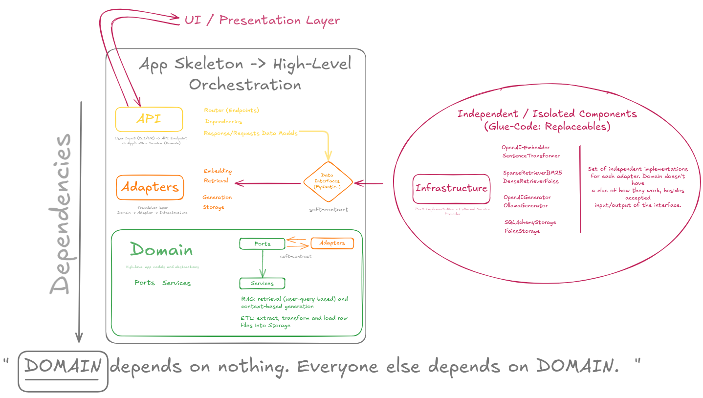

# 🧠 Local-RAG Backend & Frontend

> A minimal, modular, and production-ready Retrieval-Augmented Generation (RAG) prototype. Engineered for extensibility, portability, and robust testing using FastAPI, with support for Ollama/OpenAI and FAISS/BM25.

---


## Table of Contents

1. [Project Overview](#project-overview)
2. [Folder Layout](#folder-layout)
3. [Architecture](#architecture)
4. [Quick Start](#quick-start)
5. [Configuration](#configuration)
6. [Run & Develop](#run--develop)
7. [Tests & Coverage](#tests--coverage)
8. [Common Dev Commands](#common-dev-commands)
9. [Design Choices](#design-choices)
10. [Limitations](#limitations)
11. [Credits](#credits)

---

## Project Overview

#### Core Tenets & Design Philosophy

This project serves as a blueprint for building robust RAG systems, emphasizing:

Modularity & Testability: Achieved through a clean Hexagonal (Ports & Adapters) architecture, allowing components (LLMs, vector stores, databases) to be swapped with minimal impact.

Developer Experience: Streamlined setup, clear documentation, and a comprehensive suite of development tools (Docker, Makefile, pre-commit hooks, linters, formatters).

Production Readiness (Prototype Level): Demonstrates best practices in configuration, testing (>80% coverage), and containerization, forming a solid foundation for further development.

Flexibility: Supports fully offline operation (BM25 + SQLite) as well as integration with services like OpenAI.


#### Features
* **Hexagonal (Ports & Adapters) architecture** → Swap any component (LLM, vector DB, …) without touching business code.
* **Two retrieval modes**

  * **Sparse** BM25 (`rank‑bm25`) – default, 100 % offline.
  * **Dense** FAISS – optional, needs embeddings (run the build script `scripts/bootstrap.py` once).
  * **Hybrid** – combine both.
* **Two LLM adapters**

  * **OpenAI** (`gpt‑3.5‑turbo` by default).
  * **Ollama** (local model like `gemma3:4b`).
* **SQLite + SQLAlchemy** for documents and Q\&A history.
* **FastAPI** backend + tiny **vanilla‑JS** frontend (single `index.html`).
* **Full test suite** (unit + integration).
* **Docker‑ready & CI template** (GitHub Actions).

---
---

## 1. Project Structure

```
.
├── data/          # csv, sqlite db, faiss files                   
├── frontend/      # single‑page UI (index.html + css/js)
├── scripts/       # helper cli scripts (bootstrap.py)
├── src/           # application code (ports, adapters, api)
├── tests/         # unit + integration + e2e tests
└── docs/          # diagrams & extra docs
```

---

## 2. Why This Design?

| Need (from task)        | Our Reasoning                                      | Implementation Choice                                    |
| :---------------------- | :------------------------------------------------- | :------------------------------------------------------- |
| *Rapid Prototyping*     | Zero external infra; minimal pure‑Python deps.     | SQLite + BM25 (default), FastAPI + Vanilla JS Frontend.  |
| *Scalable Path*         | Ability to swap components without major refactor. | Ports & Adapters (Hexagonal Architecture).               |
| *AI Integration*        | Must work offline **or** with OpenAI.              | `GeneratorPort` → `OpenAIGenerator` / `OllamaGenerator`. |
| *Data Handling*         | Basic knowledge base from CSV.                     | CSV ingested into SQLite; FAISS option for dense search. |
| *Efficient Reviewer UX* | Clone → install → (build index) → test → run.      | `bootstrap.py` script, `.env`‑based `settings.py`.     |
| *Minimal UI*            | Simple, functional, no heavy frameworks.           | Single `index.html` with vanilla HTML/CSS/JS.            |

---

## 3. Architecture at a Glance

The application follows a Ports & Adapters (Hexagonal) architecture to promote separation of concerns and testability.


**Dependency Rule:** Imports flow inwards toward the `src/core` components, following the Dependency Inversion Principle.



> For a deep dive, see [`docs/architecture.md`](docs/architecture.md).

---

## 4. Quick Start

1. **Create Environment & Install Dependencies:**
```bash
# 1. Create virtual‑env
python -m venv .venv
source .venv/bin/activate   # Windows: .venv\Scripts\activate

# 2. Install in editable mode (recommended for scripts)
pip install -e .
```


2. **Initialize Database & Build Index:**

```bash
python -m scripts.bootstrap.py
```


3. **Run the Server:**
    
 ```bash
 make run # or uvicorn src.app.main:app --reload --host 0.0.0.0 --port 8000
 ```

 * UI: `http://localhost:8000/`
 * API docs: `http://localhost:8000/docs`

**Docker (Alternative):**

```bash
# Build image
docker build -t local-rag-app .

# Run backend only
docker run -p 8000:8000 -e OPENAI_API_KEY=<key> local-rag-app

# Run with Ollama using compose profile
docker compose --profile with-ollama up --build
```

---

## 5. Configuration

Settings are centralized in `src/settings.py` and can be overridden via environment variables or a `.env` file.

| Variable                 | Default                   | Required?            | Description                            |
| ------------------------ | ------------------------- | -------------------- | -------------------------------------- |
| `APP_HOST`               | `0.0.0.0`                 | No                   | Host IP for FastAPI server.            |
| `APP_PORT`               | `8000`                    | No                   | Port for FastAPI server.               |
| `RETRIEVAL_MODE`         | `sparse`                  | No                   | `sparse`, `dense` or `hybrid`.         |
| `SQLITE_URL`             | `sqlite:///./data/app.db` | No                   | SQLite connection URL.                 |
| `FAQ_CSV`                | `data/faq.csv`            | No                   | Path to FAQ CSV file.                  |
| `CSV_HAS_HEADER`         | `True`                    | No                   | CSV contains header row.               |
| `INDEX_PATH`             | `data/index.faiss`        | Only for dense mode  | Path to FAISS index file.              |
| `ID_MAP_PATH`            | `data/id_map.pkl`         | Only for dense mode  | Path to FAISS ID map.                  |
| `OPENAI_API_KEY`         | —                         | Yes, if using OpenAI | API key for OpenAI completions.        |
| `OPENAI_MODEL`           | `gpt-3.5-turbo`           | No                   | Chat model for OpenAI generator.       |
| `OPENAI_EMBEDDING_MODEL` | `text-embedding-3-small`  | No                   | Embedding model for dense retrieval.   |
| `OPENAI_TEMPERATURE`     | `0.2`                     | No                   | Sampling temperature for OpenAI calls. |
| `OLLAMA_ENABLED`         | `True`                    | No                   | Enable/disable local Ollama generator. |
| `OLLAMA_MODEL`           | `gemma3:4b`               | Only if enabled      | Model name served by Ollama.           |
| `OLLAMA_BASE_URL`        | `http://localhost:11434`  | Only if enabled      | Base URL of Ollama server.             |
| `OLLAMA_REQUEST_TIMEOUT` | `90`                      | No                   | Timeout (s) for Ollama HTTP requests.  |

---

## 6. Run & Develop

| Task                          | Command                                   |
| ----------------------------- | ----------------------------------------- |
| Run server (dev)              | `make run` or `uvicorn src.app.main:app --reload`      |
| Build / rebuild index         | `python -m scripts.bootstrap.py`           |
| Lint all files                | `black . ; isort . ; ruff check .`        |
| Run pre‑commit hooks manually | `pre-commit run --all-files`              |
| Run tests                     | `make test` (alias to `pytest -v tests/`) |

### Running scripts directly

Because we use a **`src/` layout**, Python must see the project root on `PYTHONPATH` when you run helpers:

```bash
# Good
PYTHONPATH=$PWD python scripts/bootstrap.py

# Also good (package installed in editable mode)
pip install -e .
python scripts/bootstrap.py
```

---

## Tests & Coverage

```bash
make test                   # unit + integration (35 tests)
pytest --cov=src            # quick coverage in console
pytest --cov=src -q         # quiet
pytest --cov=src --cov-report=html  # open htmlcov/index.html
```

The suite uses **in‑memory SQLite** and **stubbed FAISS / LLMs** → no downloads.

---

## 8. API Endpoints

| Method | Path           | Body (JSON)                       | Response (JSON)                                  | Description                               |
| :----: | :------------- | :-------------------------------- | :----------------------------------------------- | :---------------------------------------- |
|  `GET` | `/`            | N/A                               | HTML                                             | Serves the frontend UI.                   |
| `POST` | `/api/ask`     | `{ "question": "str", "k": int }` | `{ "answer": "str", "sources": [ {document, score}, ... ] }` | Returns AI-generated answer & source docs. |
|  `GET` | `/api/history` | Query: `limit`, `offset`          | `[ { "id": int, "question": "str", ... }, ... ]` | Retrieves past Q&A records.               |

*See interactive docs at `/docs` for full details and schemas.*


---

## 9. Design Decisions & Trade-Offs

| Aspect             | Chosen Approach                                                     | Alternatives Considered       | Rationale                                            |
| :----------------- | :------------------------------------------------------------------ | :---------------------------- | :--------------------------------------------------- |
| **Backend**        | Python, FastAPI                                                     | Flask, Django                 | Async support, Pydantic validation, auto docs.       |
| **Frontend**       | Vanilla HTML/CSS/JS                                                 | React, Vue, Jinja2 templates  | Minimal dependencies; rapid prototyping.             |
| **Architecture**   | Ports & Adapters (Hexagonal)                                        | Monolithic, Layered           | Decoupling, testability, swappable components.       |
| **Data Store**     | SQLite                                                              | In-memory list, CSV, Postgres | Simple persistent storage with ORM; zero infra.      |
| **Data Ingestion** | CSV ingested via `bootstrap.py`                                   | Direct DB input, API upload   | Script allows preprocessing and index building.      |
| **Retrieval**      | BM25 (sparse), FAISS (dense)                                        | TF-IDF, other vector DBs      | BM25 for quick start; FAISS for embedding lookup.    |
| **LLM Interface**  | Abstract `GeneratorPort` with `OpenAIGenerator` & `OllamaGenerator` | Direct SDK calls              | Enables easy switching between local and cloud LLMs. |
| **Testing**        | Pytest, `TestClient`, `unittest.mock`                               | `unittest`                    | Clean syntax, fixtures, built‑in coverage plugins.   |

* **FAISS Index Type:** IndexFlatL2 for fast setup; consider IVF or HNSW for larger corpora (>500k docs).

---

## 10. Known Limitations

* **Run `scripts/bootstrap.py` first** (DataRepos init + configured csv ETL).
* Minimal UI without automated frontend tests (manual only).
* No authentication or rate-limiting—unsuitable for open production.
* BM25 and IndexFlatL2 are prototyping choices; scale with Elasticsearch, IVF, HNSW as needed. That's why hex-arch makes sense here!
* Basic error handling; production demands finer-grained monitoring and retries.
* Timezone handling: `created_at` fields are ISO 8601 strings; UI may need conversion per locale.

---

## 11. Further Reading / Bonus

* Detailed Ports & Adapters guide: `docs/architecture.md`
* Diagrams n Stuff: `docs/`
* Performance tips for FAISS: see FAISS documentation.

---

*(Made by IntrinsicalAI, Gemini 2.5-05-06, and GPT o3 (v14/05/2025))*
