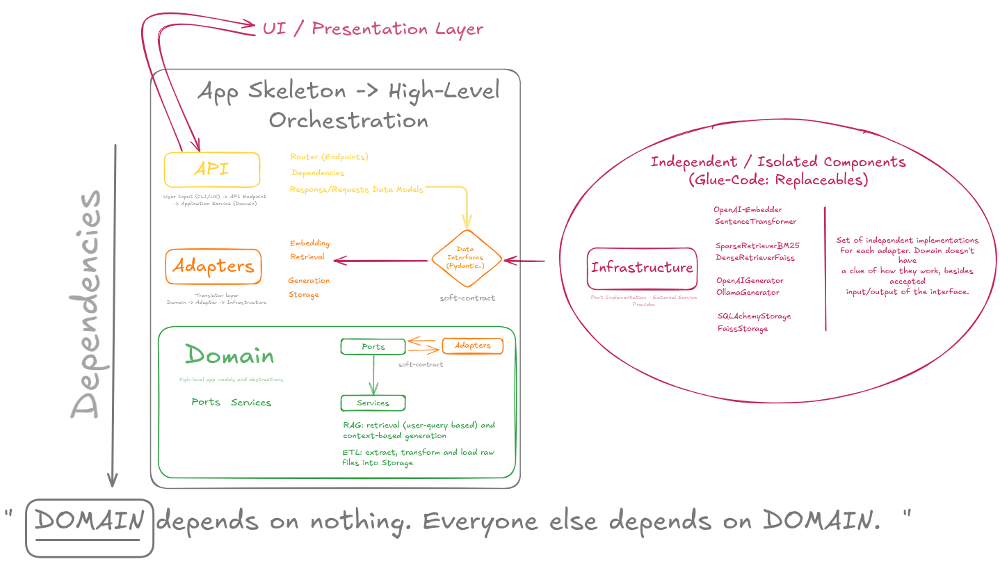

# Architecture Guide: Ports & Adapters (Hexagonal Architecture)

---

## 1. What Is Ports & Adapters?

**Ports & Adapters** (also called **Hexagonal Architecture**) is a way to organize code so that the **core logic** (business/domain rules) is separated from details like databases, APIs, or external services.

* The **Core** does not depend on any specific database, model, or API.
* All connections to the outside (APIs, DBs, LLMs) go through **Ports** (interfaces).
* **Adapters** are concrete implementations: "plug-ins" for each technology.

**Why?**

* Makes your code easier to test.
* Lets you swap databases, LLMs, etc., with almost no changes to core logic.
* Keeps the system clean and easier to grow.

---

## 2. Main Concepts

| Term        | In Practice                                                                                                          |
| ----------- | -------------------------------------------------------------------------------------------------------------------- |
| **Port**    | An *interface* in Python (an abstract base class or Protocol). Example: `DocumentRetrieverPort`, `GeneratorPort`.    |
| **Adapter** | A *class* that implements a Port for a specific tech. Example: `BM25Retriever`, `OpenAIGenerator`, `FaissRetriever`. |

**Note:**

* "Hexagonal" refers to the diagram, not to code shape.
* This is NOT the same as the classic "layered" (MVC) approach: here, all dependencies go **inward** (adapters depend on ports, not the other way).

---

## 3. How It Looks in This Project

The project follows this structure:

```
src/
├── core/           # Core logic, Ports (interfaces), domain services
├── infrastructure/ # Adapters for embeddings, LLMs, DBs, retrieval
├── app/            # FastAPI app, dependency wiring, entrypoints
```

### **Examples**

#### Ports (Interfaces) in `src/core/ports.py`

```python
# src/core/ports.py

class DocumentRetrieverPort:
    def retrieve(self, query: str, k: int) -> list:
        raise NotImplementedError

class GeneratorPort:
    def generate(self, question: str, docs: list) -> str:
        raise NotImplementedError
```

#### Adapters in `src/infrastructure/retrieval/bm25.py`

```python
# src/infrastructure/retrieval/bm25.py

from src.core.ports import DocumentRetrieverPort

class BM25Retriever(DocumentRetrieverPort):
    def __init__(self, documents):
        # ...setup BM25
        pass

    def retrieve(self, query: str, k: int):
        # ...run BM25 search
        return top_k_results
```

#### Application (API layer) in `src/app/main.py`

Here, you **inject** the implementation:

```python
from src.core.ports import DocumentRetrieverPort, GeneratorPort
from src.infrastructure.retrieval.bm25 import BM25Retriever
from src.infrastructure.generation.openai_chat import OpenAIGenerator

retriever = BM25Retriever(docs)
generator = OpenAIGenerator(api_key)

# Now, use these in your FastAPI endpoints!
```

---

## 4. How a Request Flows (Step-by-Step)

1. **User sends a question** (to `/api/ask`).
2. FastAPI handler uses **retriever port** (e.g., BM25Retriever or FaissRetriever) to get documents.
3. Handler passes docs to **generator port** (e.g., OpenAIGenerator or OllamaGenerator) to generate an answer.
4. The answer is returned to the user.

**If you want to swap BM25 for FAISS:**

* You only change which adapter is "plugged in".
* No change to main app logic, ports, or endpoints.

---

## 5. Benefits

* **Easy to Test**: You can replace real adapters with *mocks* in tests.
* **Easy to Extend**: Add new LLMs or retrievers by creating new adapters.
* **Less Tech Lock-in**: Change DB, LLM, vector index… core stays the same.
* **Better for Teams**: Teams can work on different adapters without conflict.

---

## 6. Trade-Offs

* **More files & structure** than "quick scripts".
* **More abstract**: Newcomers may need to learn about Ports/Adapters.
* For very simple, short scripts, this may be "overkill".
* But for real projects, it's much easier to scale and maintain.

---

## 7. How to Add or Change Adapters

* To add a new retriever (e.g., ElasticSearchRetriever):

  1. Create a new class that implements `DocumentRetrieverPort`.
  2. Plug it in at app start (FastAPI dependency).
* To add a new LLM (e.g., HuggingFaceGenerator):

  1. Create a class for it, implement `GeneratorPort`.
  2. Wire it up via settings/env or code.

**Testing:**

* Use mocks/fakes for ports in unit tests.
* Only test adapters separately if needed.

---

## 8. Diagram



---

## 9. Final Notes

* This architecture makes your backend **modular, robust, and future-proof**.
* It’s worth the small up-front effort for any non-trivial system.
* If you want to extend this project, **just add a new adapter and wire it up!**

---


## 10. Resources

* [Alistair Cockburn’s Hexagonal Architecture](https://alistair.cockburn.us/hexagonal-architecture/)
* [FastAPI Dependency Injection](https://fastapi.tiangolo.com/tutorial/dependencies/)
* [Clean Architecture (Uncle Bob)](https://8thlight.com/blog/uncle-bob/2012/08/13/the-clean-architecture.html)

---


**Any contributor can follow these principles to add features without fear of breaking the core logic.**

---

*Questions? Open an issue, or check the source for more real examples!*
