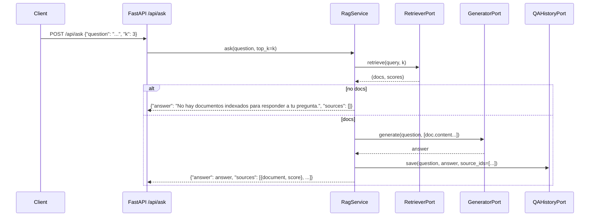

# Architecture Guide: Hexagonal (Ports & Adapters)

The **Intrinsical RAG Prototype** uses a **Hexagonal architecture** (a.k.a. Ports & Adapters) to maximize modularity, testability, and maintainability. Business logic lives in the core; external tech (LLMs, vector stores, databases) are plugged in via adapters.

## Core Principles

* **Dependency Inversion**: the core depends on *ports* (interfaces), never on concrete implementations.
* **Stable Core**: domain entities and services are tech-agnostic.
* **Adapters at the Edge**: infrastructure code implements the ports.
* **Composition Root**: `app/factory.py` wires ports to adapters based on settings.
* **Testability**: adapters can be swapped for fakes/mocks; ports are `Protocol`s.

---

## Project Structure

```
src/local_rag_backend/
├── core/                       # Domain + application services (technology-agnostic)
│   ├── domain/                 # Entities (Document, etc.)
│   ├── ports/                  # Ports (Protocols) for core dependencies
│   └── services/               # ETL, IngestionPipeline, RagService
├── infrastructure/             # Adapters (technology-specific)
│   ├── embeddings/             # ST/OpenAI embedders
│   ├── llms/                   # OpenAI / Ollama generators
│   ├── persistence/            # SQLAlchemy (SQL), FAISS (vectors)
│   ├── retrieval/              # BM25 (sparse), FAISS (dense), Hybrid
│   └── ingestion/              # CSV loader, etc.
├── app/                        # Application layer
│   ├── main.py                 # FastAPI app + lifespan
│   ├── api_router.py           # HTTP endpoints (/api/ask, /api/history)
│   ├── dependencies.py         # DI bridge to factory
│   └── factory.py              # Composition root (build retriever/LLM/services)
└── scripts/                    # CLI helpers (bootstrap, build_index)
```

---

## Dependency Flow (High-Level)

```mermaid
graph TD
  A[FastAPI Router] --> B[RagService]
  B --> C[RetrieverPort]
  B --> D[GeneratorPort]
  B --> E[QAHistoryPort]

  subgraph Core
    B
    C
    D
    E
  end

  subgraph Infrastructure (Adapters)
    C1[SparseBM25Retriever]
    C2[DenseFaissRetriever]
    C3[HybridRetriever]
    D1[OpenAIGenerator]
    D2[OllamaGenerator]
    E1[HistorySqlStorage]
    S1[SqlDocumentStorage]
    V1[FaissVectorStorage]
  end

  A -->|DI via factory| C1 & C2 & C3 & D1 & D2 & E1 & S1 & V1
```

The composition root `app/factory.py` chooses specific adapters (BM25/FAISS/Hybrid; OpenAI/Ollama) using `settings.py`.

---

## Key Ports (Core Interfaces)

Source of truth: `src/local_rag_backend/core/ports/__init__.py`.

```python
# src/local_rag_backend/core/ports/__init__.py
from collections.abc import Iterable, Sequence
from typing import Protocol, runtime_checkable

from local_rag_backend.core.domain.entities import Document, Embedding, LoadedItem

@runtime_checkable
class EmbedderPort(Protocol):
    dim: int
    def embed(self, texts: Sequence[str]) -> Sequence[Embedding]: ...

@runtime_checkable
class GeneratorPort(Protocol):
    def generate(self, question: str, contexts: Sequence[str]) -> str: ...

@runtime_checkable
class RetrieverPort(Protocol):
    def retrieve(self, query: str, k: int = 5) -> tuple[Sequence[Document], Sequence[float]]: ...

@runtime_checkable
class DocumentRepoPort(Protocol):
    def store_documents(self, contents: Sequence[str]) -> Sequence[int]: ...
    def delete_documents(self, ids: Sequence[int]) -> None: ...
    def get(self, ids: Sequence[int]) -> Sequence[Document]: ...
    def get_all_documents(self) -> Sequence[Document]: ...

@runtime_checkable
class VectorRepoPort(Protocol):
    def upsert(self, ids: Sequence[int], vectors: Sequence[Embedding]) -> None: ...
    def delete(self, ids: Sequence[int]) -> None: ...
    def rebuild(self, ids: Sequence[int], vectors: Sequence[Embedding]) -> None: ...
    def similar(self, vector: Embedding, k: int) -> Sequence[tuple[int, float]]: ...

@runtime_checkable
class QAHistoryPort(Protocol):
    def save(self, q: str, a: str, source_ids: Sequence[int]) -> None: ...

@runtime_checkable
class LoaderPort(Protocol):
    def load(self) -> Iterable[LoadedItem]: ...
```

---

## Representative Adapters

**Retrievers**

* `SparseBM25Retriever` (BM25 over preprocessed text; SQL for doc lookup)
* `DenseFaissRetriever` (SentenceTransformers/OpenAI embeddings + FAISS; SQL for doc lookup)
* `HybridRetriever` (linear blend of dense + sparse, configurable `alpha`)

**LLMs**

* `OpenAIGenerator` (chat completions)
* `OllamaGenerator` (HTTP to local Ollama server)

**Persistence**

* `SqlDocumentStorage` (documents via SQLAlchemy/SQLite)
* `FaissVectorStorage` (vector index + ID map)
* `HistorySqlStorage` (Q\&A history)

**Ingestion**

* `CSVLoader` → `IngestionPipeline` → `ETLService` (store docs, embed, upsert vectors)

All of these implement the ports above and can be swapped at composition time.

---

## Composition Root (Factory)

`app/factory.py` wires the system from configuration (source of truth: `src/local_rag_backend/app/factory.py`):

* Chooses **retriever** by `settings.retrieval_mode` (`sparse`, `dense`, `hybrid`)
* Chooses **generator**: Ollama (if `OLLAMA_ENABLED`) or OpenAI (if `OPENAI_API_KEY`)
* Instantiates `RagService(retriever, generator, history_storage)`
* Provides a process-local singleton via `get_rag_service()` (and `reset_rag_service()` for tests)

---

## Request Flow (End-to-End)


```mermaid
sequenceDiagram
  participant U as Client
  participant API as FastAPI /api/ask
  participant S as RagService
  participant R as RetrieverPort
  participant G as GeneratorPort
  participant H as QAHistoryPort

  U->>API: POST /api/ask {"question": "...", "k": 3}
  API->>S: ask(question, top_k=k)
  S->>R: retrieve(query, k)
  R-->>S: (docs, scores)
  alt no docs
    S-->>API: {"answer": "No hay documentos indexados para responder a tu pregunta.", "sources": []}
  else docs
    S->>G: generate(question, [doc.content...])
    G-->>S: answer
    S->>H: save(question, answer, source_ids=[...])
    S-->>API: {"answer": answer, "sources": [{document, score}, ...]}
  end
```

`/api/history` reads persisted Q\&A with pagination.

---

## Multi-Store Consistency (SQLite + FAISS)

In dense/hybrid retrieval, the system has **two stores**:

* **SQLite** (`documents` table) is the source of truth for document text.
* **FAISS** (`INDEX_PATH` + `ID_MAP_PATH`) is derived state: it maps `document_id -> embedding vector`.

The invariants that matter:

* Document IDs must be stable (SQLite uses `AUTOINCREMENT` to avoid ID reuse after deletes).
* Writes must keep SQL and FAISS consistent, or fall back to a safe recovery path.

Maintenance logic lives in `src/local_rag_backend/core/services/maintenance.py`:

* `delete_documents_multi_store(...)`: delete from SQLite, attempt to delete vectors, and optionally rebuild the full index if index deletion fails.
* `rebuild_index_from_db(...)`: idempotent rebuild of FAISS from the current SQLite docs.

Because the application caches a process-local singleton `RagService`, API/CLI maintenance operations call `reset_rag_service()` after mutating the DB and/or index so subsequent queries see the updated state.

---

## HTTP API Surface

The FastAPI router lives in `src/local_rag_backend/app/api_router.py` (mounted under `/api`).
In addition to `/api/ask` and `/api/history`, the project exposes:

* `POST /api/docs` and `GET /api/docs` (ingest/list documents)
* `POST /api/docs/delete` (delete docs by ID; keeps SQL + FAISS consistent when applicable)
* `POST /api/index/rebuild` (idempotent rebuild of FAISS from SQLite; dense/hybrid only)
* `POST /api/ask_eval` (ephemeral per-request RAG configuration)
* `POST /api/openrouter/generate` (OpenRouter proxy when configured)
* `GET /api/config` and `GET /api/templates`
* `GET /api/health`, `GET /api/ready`, `GET /api/health/ollama`

For current request/response shapes, prefer the OpenAPI schema at `GET /openapi.json` (or `GET /docs` in dev).

---

## Extending the System

**Add a new retriever (e.g., Elasticsearch):**

1. Implement `RetrieverPort`.
2. Resolve documents (by ID) via your `DocumentRepoPort` implementation.
3. Expose a setting (e.g., `RETRIEVAL_MODE=elasticsearch`) and branch in `factory.py`.

**Add a new LLM (e.g., Anthropic):**

1. Implement `GeneratorPort`.
2. Add settings (API key, model, etc.).
3. Select in `factory.get_generator()` based on settings.

**Swap embeddings backend:**

* Implement `EmbedderPort` (or reuse `OpenAIEmbedder` / `SentenceTransformerEmbedder`).
* Ensure FAISS index dimensionality matches `embedder.dim`.
* Rebuild the index after changing the embedding model.

---

## Testing Strategy

* **Unit tests**: mock the ports to isolate core services (`RagService`, `ETLService`, `IngestionPipeline`).
* **Integration tests**: real SQLite (temp), optional FAISS, real BM25; adapters tested together.
* **E2E tests**: FastAPI `TestClient` hitting `/api/ask` and `/`.

The codebase already includes fixtures (e.g., in-memory SQLite with `StaticPool`), adapter fakes, and coverage for edge cases (dim mismatches, missing docs, error propagation).

---

## Trade-offs & Considerations

* More files/indirection than a simple script, but greatly improved swapability and testability.
* FAISS `IndexFlatL2` is chosen for simplicity; for larger corpora, consider IVF/HNSW and external vector DBs.
* The RAG prompt templates live in settings; adapt them to your safety/grounding needs.

---

## Minimal Code Examples

**Port usage in a service (core):**

```python
# src/local_rag_backend/core/services/rag.py
class RagService:
    def __init__(self, retriever, generator, history):
        self.retriever = retriever
        self.generator = generator
        self.history = history

    def ask(self, question: str, top_k: int = 3):
        docs, scores = self.retriever.retrieve(question, top_k)
        if not docs:
            answer = "No hay documentos indexados para responder a tu pregunta."
            self.history.save(question, answer, [])
            return {"answer": answer, "docs": [], "scores": []}
        answer = self.generator.generate(question, [d.content for d in docs])
        self.history.save(question, answer, [d.id for d in docs])
        return {"answer": answer, "docs": docs, "scores": scores}
```

**Adapter implementing a port (sparse example):**

```python
# src/local_rag_backend/infrastructure/retrieval/sparse_bm25.py
class SparseBM25Retriever(RetrieverPort):
    def __init__(self, documents, doc_ids, doc_repo):
        # tokenize+fit BM25; keep doc_repo to resolve IDs -> Document
        ...

    def retrieve(self, query: str, k: int = 5):
        # BM25 scores -> normalize -> map to Document via repo -> return (docs, scores)
        ...
```

**Factory wiring:** see `src/local_rag_backend/app/factory.py` (kept as the single source of truth to avoid drift).
